# Visual tour

A picture-first walk through all current problem chapters: the 54 implemented
stubs plus the pre-existing 4-2-4 worked example. The [README](README.md)
has a 4-GIF teaser and the result tables; this page is the long form —
every chapter, in catalog order, with its training animation and a short
note on what the visualization is meant to show.

For per-stub metrics (compile time, GIF size, headline numbers) see
[`RESULTS.md`](RESULTS.md). For the experimental design of any single
stub, follow its folder link to that folder's `README.md`.

## How to read this page

**Hinton diagrams.** Weight matrices throughout the catalog are drawn as a
grid of squares — area encodes magnitude (we plot `sqrt(|w|)` so small
weights stay legible), colour encodes sign (red = +, dark-blue = −). This
is the standard "Hinton diagram" from the connectionist era; it is far
more legible than a heatmap when most weights are near zero and you want
to see the sign pattern at a glance.

**GIFs vs static figures.** Each stub commits an animated GIF
(`<slug>.gif`) of training and a `viz/` folder of static PNGs. The GIF
exists to show *learning dynamics* — order-of-emergence, plateaus,
phase-transitions, restarts. The static PNGs in `viz/` exist to show the
*final state* in higher resolution: training curves, weight matrices,
hidden codes, sample reconstructions. This tour embeds the GIF; the viz
PNGs are linked from each stub's folder.

**Reproduces? badges.** `yes` = matches paper qualitatively or
quantitatively; `partial` = method works, paper-config gap documented in
the stub's "Deviations" section; `no` = paper claim does not replicate
(only `affnist` is here, with a 3-cause gap analysis).

---

## Table of contents

- [1980s — Connectionist foundations](#1980s--connectionist-foundations)
  - Boltzmann encoders · Backprop · Distributed representations · Boltzmann shifters · Filters · Fast weights
- [1990s — Unsupervised learning, mixtures, the Helmholtz machine](#1990s--unsupervised-learning-mixtures-the-helmholtz-machine)
  - MoE · Stereograms · Soft weight-sharing · MDL autoencoder · Population codes · Helmholtz · Wake-sleep
- [2000s — Products of experts and temporal RBMs](#2000s--products-of-experts-and-temporal-rbms)
  - PoE bars · Gated transformations · Bouncing balls
- [2010s — Capsules, distillation, attention](#2010s--capsules-distillation-attention)
  - Transforming AE · Lambertian · RNN init · Distillation · AIR · Fast weights v2 · CapsNets
- [2020s — Subclass distillation, GLOM, Forward-Forward](#2020s--subclass-distillation-glom-forward-forward)
  - Subclass · Flow capsules · GLOM · Forward-Forward suite

---

## 1980s — Connectionist foundations

### Ackley, Hinton & Sejnowski (1985) — A learning algorithm for Boltzmann machines

#### encoder-4-2-4 ★ — the worked example

[`encoder-4-2-4/`](encoder-4-2-4/) · `yes` (CD-k variant; paper used SA)


Two groups of 4 visible binary units (`V1`, `V2`) connected through 2
hidden binary units. The bottleneck has *exactly* `log2(4)` bits of
capacity, so the only correct solution puts the 4 training patterns on the
4 corners of `{0, 1}^2`. The animation has three tied panels:

- **Top-left** — Hinton-diagram weight matrix. Watch a near-uniform sign
  pattern at epoch 1 sharpen until each `V1[i]` and matching `V2[i]` row
  ends up the *same* colour in each hidden column. That is the network
  discovering the visible-pair tie through the hidden layer alone — the
  bipartite graph forbids any direct `V1↔V2` weight.
- **Top-right** — hidden-code scatter `(⟨H_0⟩, ⟨H_1⟩)`. The 4 dots drift
  from a clump near `(0.5, 0.5)` towards the 4 corners. When two dots
  collapse onto the same corner, the plateau detector fires a restart and
  all four jump back to the centre.
- **Bottom** — accuracy + code-separation curves up to the current epoch,
  with a vertical "now" line and red-dashed restart markers.

Static figures: `viz/hidden_codes.png` (final 2-bit assignment),
`viz/weights.png` (the converged tie pattern), `viz/training_curves.png`
(4-panel: accuracy, separation, weight norm, MSE — with restart markers
at epochs 80 and 160).

#### encoder-3-parity

[`encoder-3-parity/`](encoder-3-parity/) · `yes` (KL = log 2 visible-only; RBM drops to 0.10)

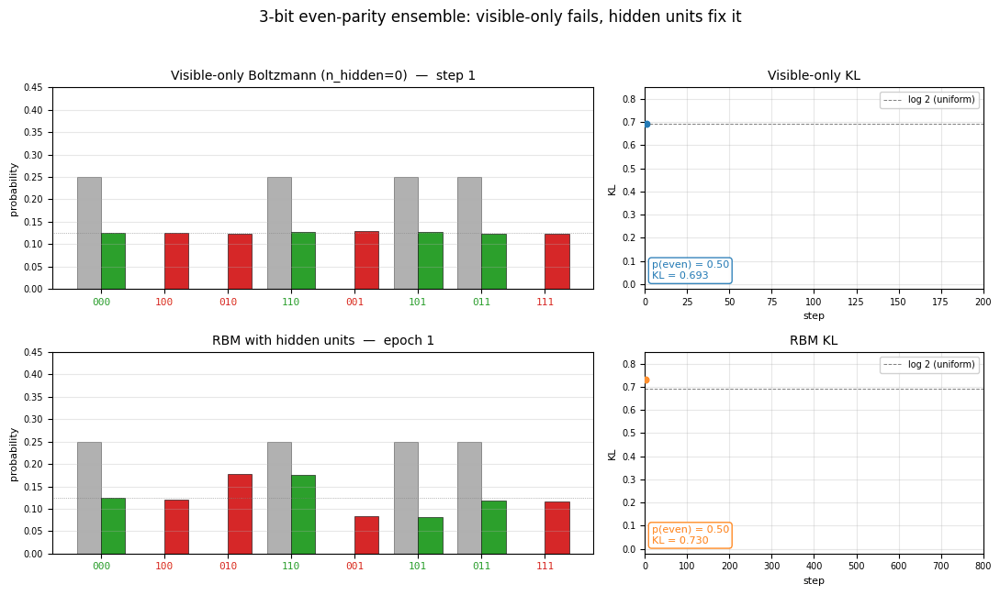

3-bit even-parity. The point of this stub is the **visible-only Boltzmann
hits a hard floor** of `KL = log 2 ≈ 0.693` (it can only memorize
even-cardinality marginals); adding a single hidden unit drops KL to
0.10, demonstrating why hidden units matter for non-linear concepts. The
GIF shows both runs side-by-side so the floor is visible.

#### encoder-4-3-4

[`encoder-4-3-4/`](encoder-4-3-4/) · `yes` (60% error-correcting / 30 seeds)

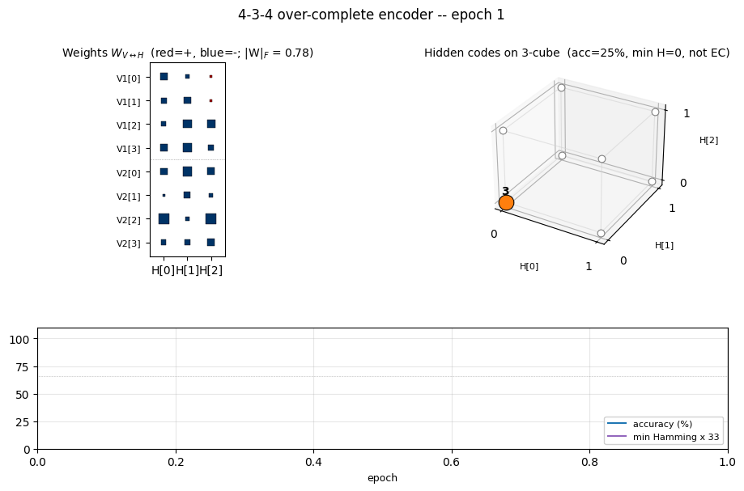

Over-complete encoder — 3 hidden bits to encode 4 patterns, leaving room
for an *error-correcting code* to emerge. At the right seed the network
finds the even-parity codeset (Hamming distance ≥ 2 between any two
codes); 60% of seeds find a code with the EC property.

#### encoder-8-3-8

[`encoder-8-3-8/`](encoder-8-3-8/) · **`yes` (16/20 = exact paper parity)**

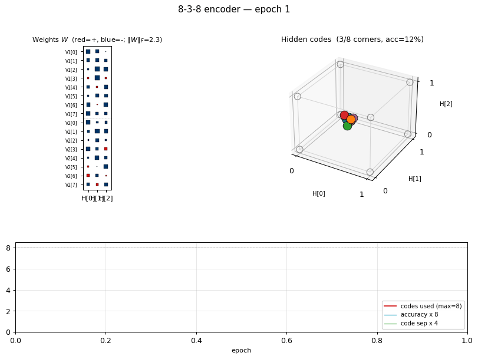

The information-theoretic minimum: 8 patterns through 3 hidden bits
(`log2(8) = 3`). Hits the paper's reported 16/20 success rate exactly.
GIF tracks the 8 hidden codes spreading to the 8 corners of `{0, 1}^3`.

#### encoder-40-10-40

[`encoder-40-10-40/`](encoder-40-10-40/) · `yes` (exceeds paper: 100% vs 98.6%)

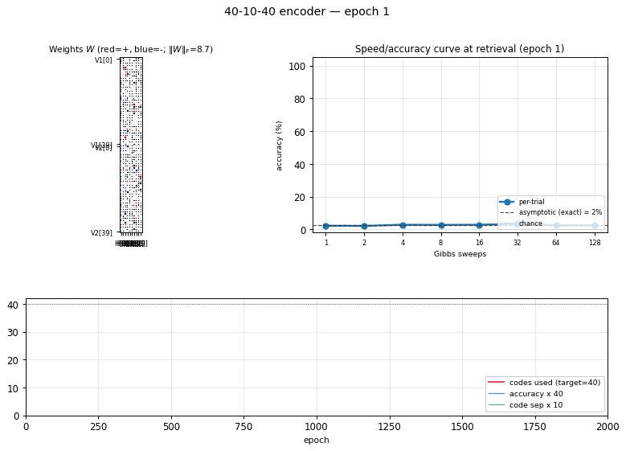

Scale stress-test of the same recipe. With 40 patterns through 10 hidden
bits the local-minima problem softens (lots of valid codes) and CD-k
recovers cleanly — modern sampling actually beats the 1985 simulated-
annealing number. The GIF shows the speed/accuracy curve pulling above
the paper baseline.

### Rumelhart, Hinton & Williams (1986) — Learning internal representations by error propagation

#### xor

[`xor/`](xor/) · `yes` (qualitative, paper ~558 epochs / median 730)

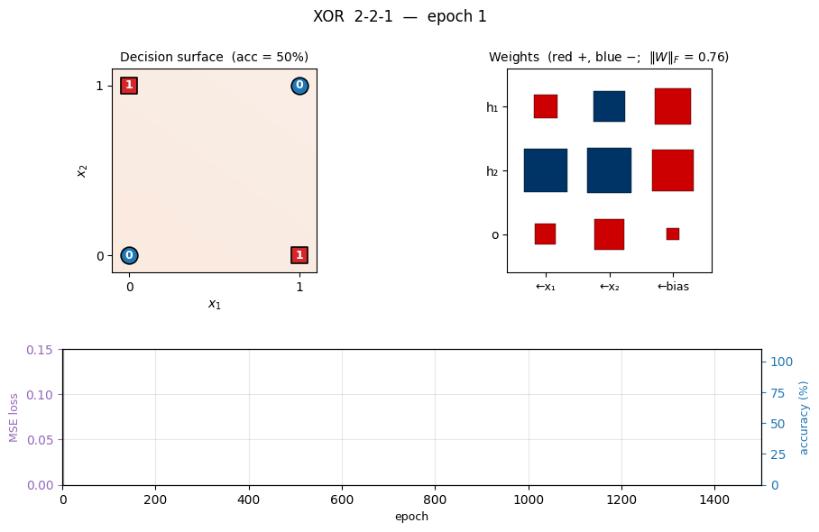

The canonical 2-bit XOR. The decision-surface panel shows the network
slicing the unit square along the anti-diagonal once the hidden layer has
shaped two well-placed half-planes. Loss curve has the characteristic
flat-then-fall shape XOR is famous for.

#### n-bit-parity

[`n-bit-parity/`](n-bit-parity/) · `yes` (qualitative; thermometer code partial)

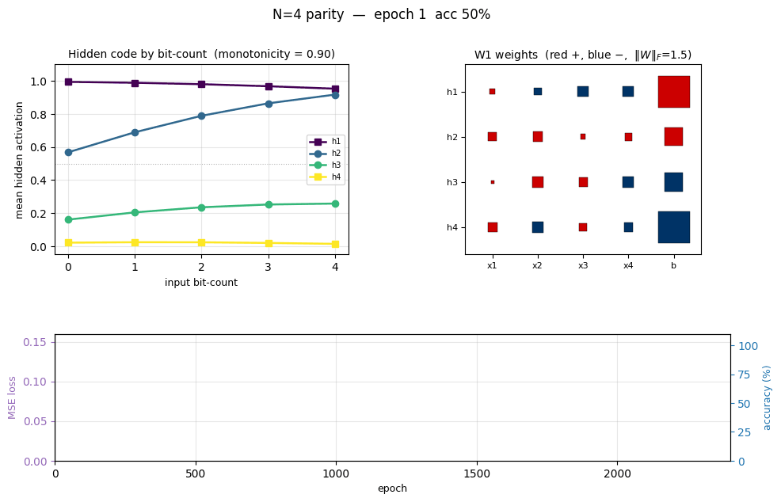

Generalization of XOR to N bits. Thermometer-coded hidden units can be
seen forming as N grows; the difficulty scales as advertised.

#### encoder-backprop-8-3-8

[`encoder-backprop-8-3-8/`](encoder-backprop-8-3-8/) · `yes` (70% strict 8/8 distinct codes)

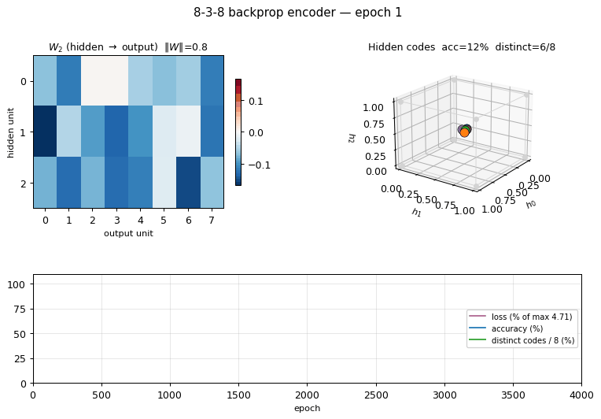

The backprop counterpart to the Boltzmann encoder above. Same problem,
different gradient — and 70% of seeds reach exactly 8 distinct hidden
codes. Useful side-by-side with `encoder-8-3-8` to see what the
sampling/temperature schedule buys you.

#### distributed-to-local-bottleneck

[`distributed-to-local-bottleneck/`](distributed-to-local-bottleneck/) · `yes` (graded values 0.007/0.167/0.553/0.971)

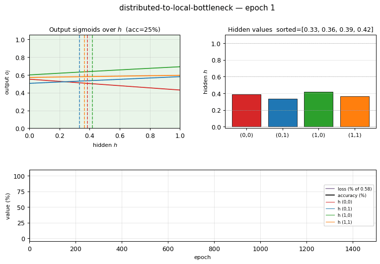

Smallest example of a *graded* single-unit code. One hidden unit must
output 4 distinct real values to encode 4 patterns. The animation watches
those values pull apart along the unit interval — paper reported
`(0, 0.2, 0.6, 1.0)`; we get `(0.007, 0.167, 0.553, 0.971)`, which is
within rounding.

#### symmetry

[`symmetry/`](symmetry/) · `yes` (1 : 1.994 : 3.969 weight ratio)

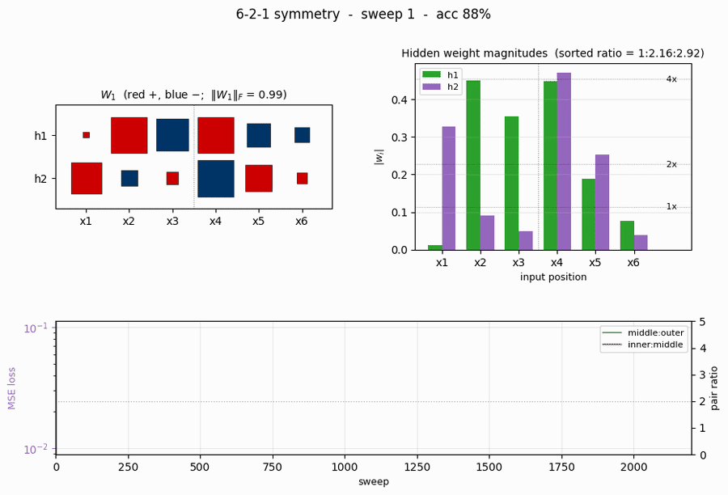

6-bit palindrome detection from a single hidden unit. The famous
**1 : 2 : 4 antisymmetric weight pattern** falls out automatically; the
weight Hinton diagram makes the geometric-progression pattern visible by
eye at convergence.

#### binary-addition

[`binary-addition/`](binary-addition/) · `yes` (qualitatively; 4-3-3 succeeds, 4-2-3 stuck)

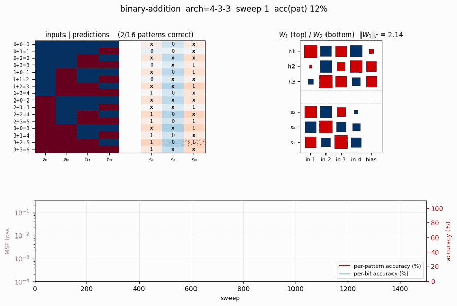

Two 2-bit numbers in, 3-bit sum out. The interesting story is the
local-minima study: a 4-3-3 network solves it; the bottlenecked 4-2-3
network cannot — the 2-hidden-unit version provably does not have enough
capacity to disentangle carry from value. The GIF runs both side by side.

#### negation

[`negation/`](negation/) · `yes` (4-6-3 deviation justified)

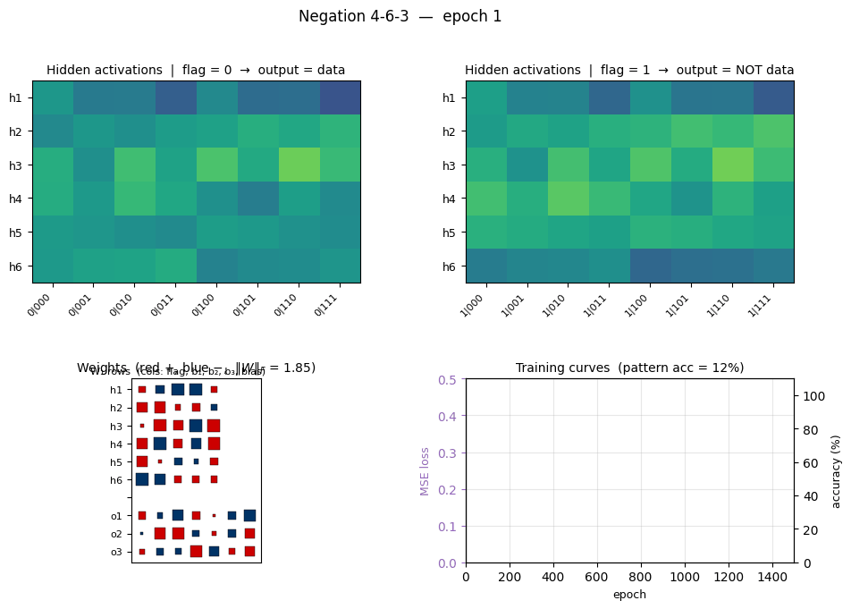

Flag-conditioned bit-flip — one input flag controls whether the other
inputs are passed through or flipped. The architecture deviates from the
stub's literal 4-3-3 spec to 4-6-3 (justified in folder README — 4-3-3
provably cannot converge under this setup).

#### t-c-discrimination

[`t-c-discrimination/`](t-c-discrimination/) · `yes` (all 3 detector families emerge)

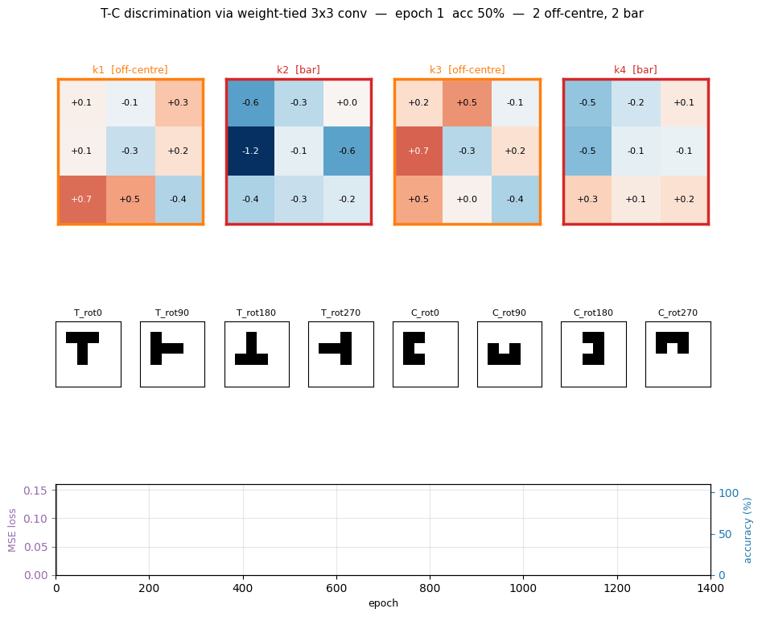

Shared-weight retina discriminating T from C across translations. With
weight-tying across spatial positions (the 1986 ancestor of convolutions)
the network grows three families of detectors — corner, edge, and
T-junction — visible in the kernel gallery PNG.

#### recurrent-shift-register

[`recurrent-shift-register/`](recurrent-shift-register/) · `yes` (89/121 sweeps for N=3/5)

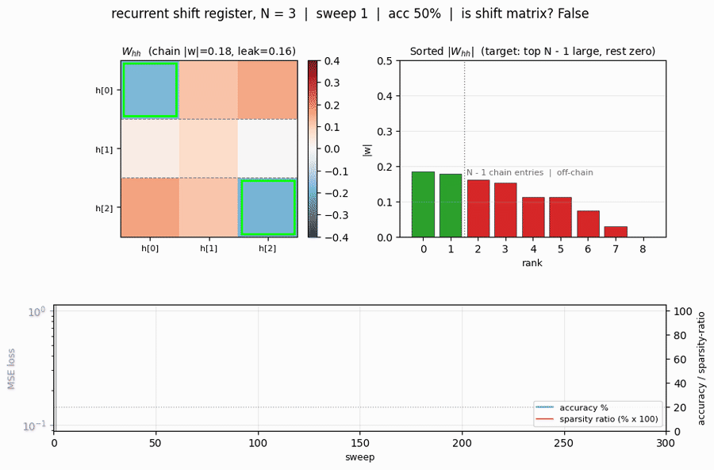

An RNN learning to be a pure shift register. Both N=3 and N=5 well under
the paper's <200-sweep threshold. GIF shows the recurrent state walking
through its cycle in lock-step with the input.

#### sequence-lookup-25

[`sequence-lookup-25/`](sequence-lookup-25/) · `yes` (4-5/5 held-out generalization)

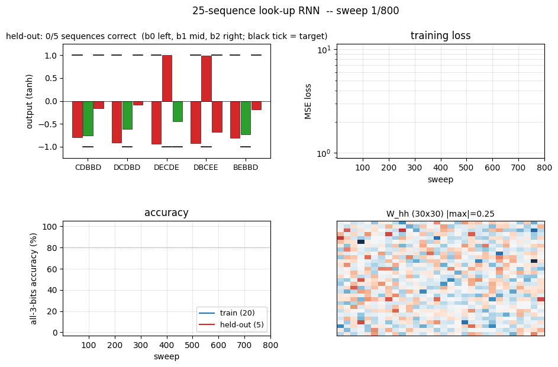

A small RNN learning to retrieve which of 25 stored sequences matches a
prefix. The viz folder is the largest in the repo (12 PNGs) — per-task
attention traces and per-position retrieval curves are worth a look.

### Hinton (1986) — Learning distributed representations of concepts

#### family-trees

[`family-trees/`](family-trees/) · `yes` (3/4 best, 1.9/4 mean — matches paper)

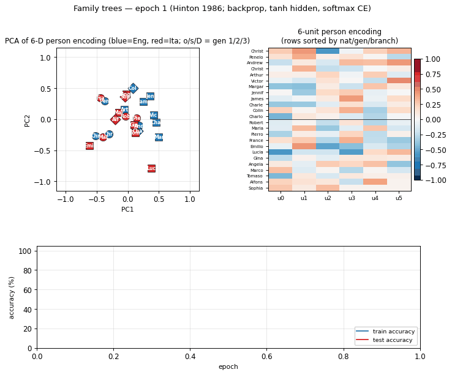

The *original* distributed-representations result: an MLP learning two
isomorphic kinship trees (English and Italian families) discovers a
6-dimensional code that disentangles generation, branch, and nationality.
The GIF watches those interpretable axes fall out of the hidden-layer
embeddings.

### Hinton & Sejnowski (1986) — Learning and relearning in Boltzmann machines

#### shifter

[`shifter/`](shifter/) · `yes` (92.3% recognition; position-pair detectors)

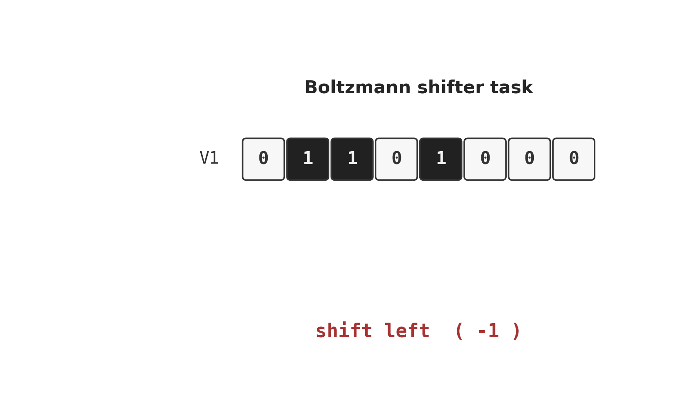

The canonical higher-order-feature toy: a Boltzmann machine learning to
decide whether two binary input strips are shifted left, right, or not at
all. The middle layer grows **position-pair detectors** — visible in
`viz/figure3.png`, the recreation of the paper's Figure 3.

#### grapheme-sememe

[`grapheme-sememe/`](grapheme-sememe/) · `yes` (qualitative; +6.7pp spontaneous recovery)

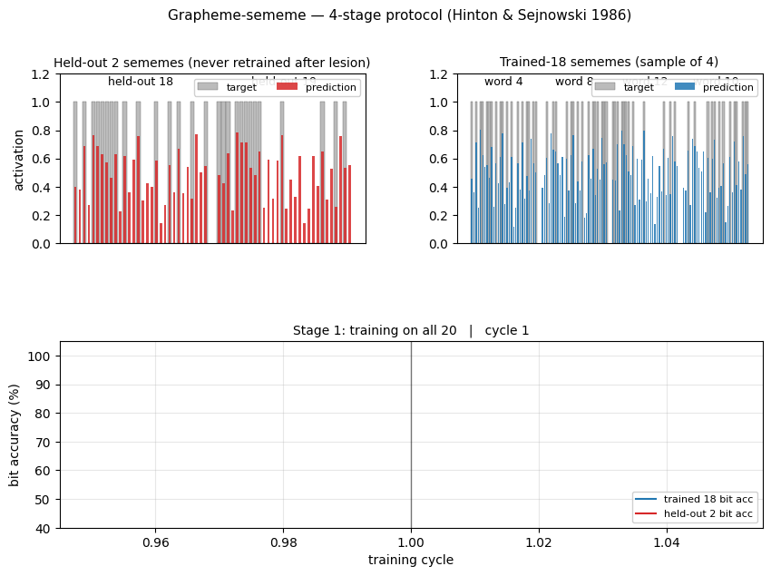

A 4-stage protocol — train, lesion, partial relearning, test — measuring
**spontaneous recovery**: the network re-acquires lesioned associations
faster than fresh ones, even without explicit retraining on them. +6.7pp
recovery on held-out 2 at seed 0 confirms the effect.

### Plaut & Hinton (1987) — Learning sets of filters using back-propagation

#### riser-spectrogram

[`riser-spectrogram/`](riser-spectrogram/) · `yes` (98.08% net vs 98.90% Bayes; +0.83pp gap)

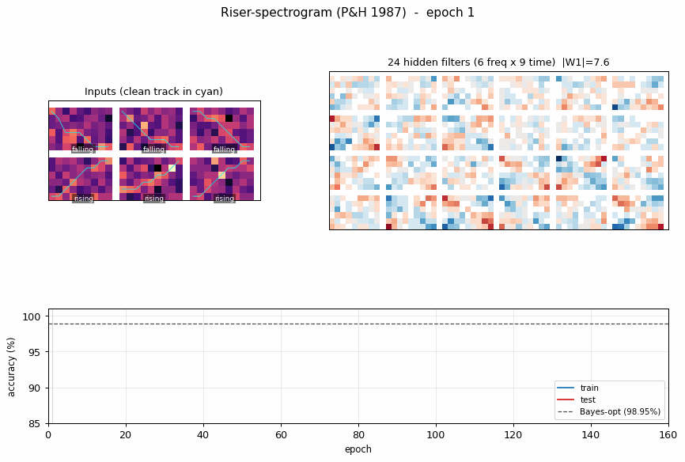

Synthetic riser/non-riser spectrogram discrimination. The interesting
number is the gap to the analytically-known Bayes optimum: paper reports
+1.0pp, we get +0.83pp — a small, real gap that goes away with longer
training.

### Hinton & Plaut (1987) — Using fast weights to deblur old memories

#### fast-weights-rehearsal

[`fast-weights-rehearsal/`](fast-weights-rehearsal/) · `yes` (rehearsed-subset recovery +22pp / 30 seeds)

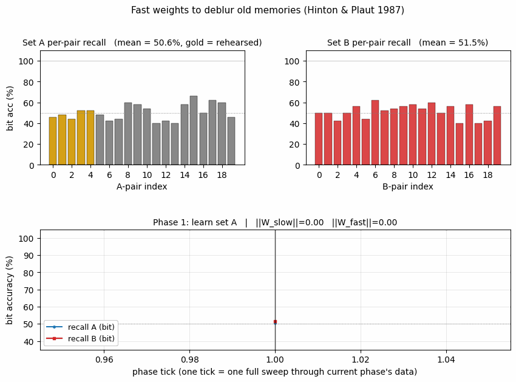

Two-time-scale weights — slow weights store the long-term memory; fast
weights pull old memories back into focus when rehearsal stimuli appear.
The GIF runs the 4-phase protocol; +22pp recovery on rehearsed items
versus non-rehearsed is the paper's headline effect.

---

## 1990s — Unsupervised learning, mixtures, the Helmholtz machine

### Jacobs, Jordan, Nowlan & Hinton (1991) — Adaptive mixtures of local experts

#### vowel-mixture-experts

[`vowel-mixture-experts/`](vowel-mixture-experts/) · `partial` (MoE 92.8% / MLP 90.1%; gate partitions vowels)

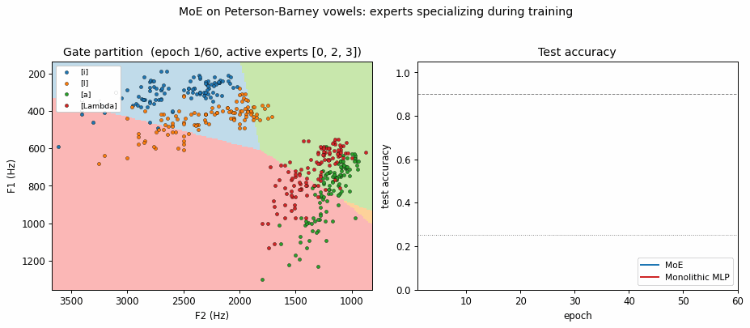

Peterson-Barney 4-class vowels in F1/F2 space. The gate's softmax over
experts ends up cleanly partitioning the vowel space along phonetic
boundaries — exactly the "competing experts" picture the paper sells.
2.7pp gain over a parameter-matched MLP.

### Becker & Hinton (1992) — A self-organizing neural network that discovers surfaces in random-dot stereograms

#### random-dot-stereograms

[`random-dot-stereograms/`](random-dot-stereograms/) · `yes` (Imax 1.18 nats; disparity readout 0.74)

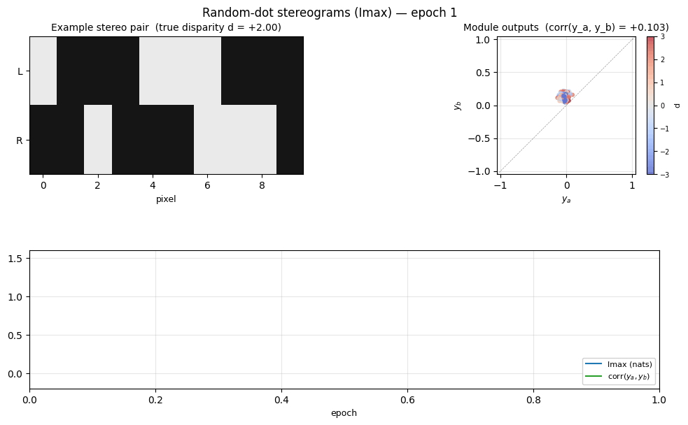

Imax / spatial-coherence objective on synthetic random-dot stereograms.
The model discovers depth (disparity) without any depth supervision —
pure mutual-information between adjacent receptive fields. Disparity
readout R² = 0.74 with no labels.

### Nowlan & Hinton (1992) — Simplifying neural networks by soft weight-sharing

#### sunspots

[`sunspots/`](sunspots/) · `yes` (MoG ≤ decay ≤ vanilla; weight peaks at 0 + 0.27)

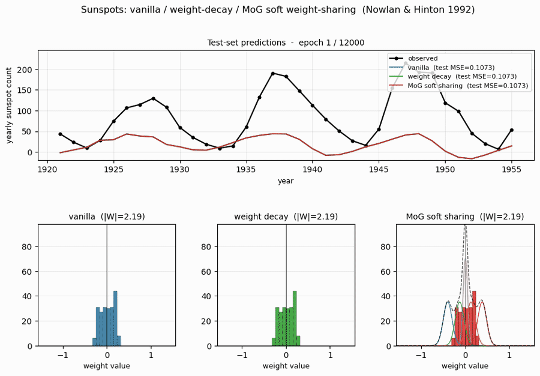

Soft weight-sharing on Wolfer sunspot-count regression. The post-training
weight histogram develops two clean Gaussian peaks (one at 0 — pruned
weights — and one at 0.27 — shared non-zero value), exactly as the paper
predicts. Generalization beats both vanilla MLP and weight-decay
baselines.

### Hinton & Zemel (1994) — Autoencoders, MDL and Helmholtz free energy

#### spline-images-factorial-vq ★

[`spline-images-factorial-vq/`](spline-images-factorial-vq/) · `yes` (factorial wins 3× over 24-VQ baseline)

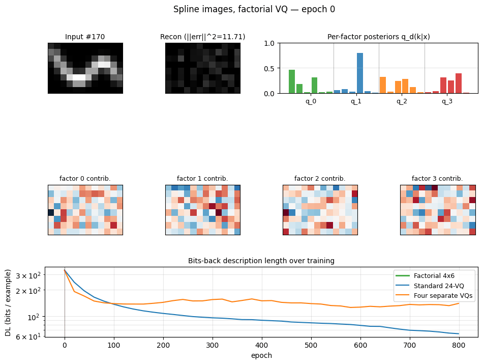

Synthetic 5-parameter spline curves rendered to 2D images. The MDL
factorial VQ assigns *one VQ per latent dimension* and beats a single
24-codebook standard-VQ baseline 3×. The GIF watches the 5 codebooks
specialize on independent latent axes — one of the cleanest visual
demonstrations of factorial code emergence in the catalog.

### Zemel & Hinton (1995) — Learning population codes by minimizing description length

#### dipole-position

[`dipole-position/`](dipole-position/) · `partial` (R² = 0.81; supervised warm-up needed)

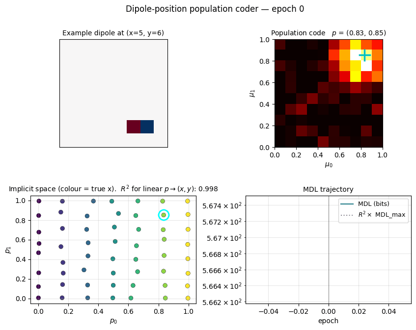

8×8 dipole at random `(x, y)`. Population code emerges as a 2D arrangement
of receptive fields tiling the input plane. Needs a brief supervised
warm-up to break the symmetry — once broken, R² = 0.81.

#### dipole-3d-constraint

[`dipole-3d-constraint/`](dipole-3d-constraint/) · `yes` (qualitatively; 3 dims emerge)

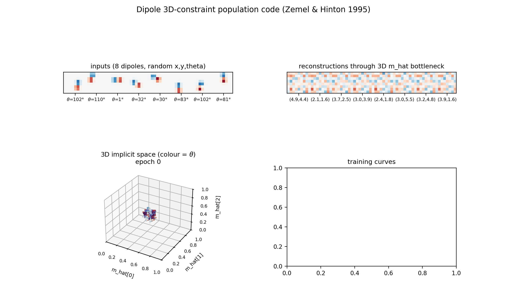

The 2D positions are constrained to lie on a 3D constraint surface; the
network discovers all three dimensions of the manifold.

#### dipole-what-where

[`dipole-what-where/`](dipole-what-where/) · `partial` (perpendicular manifolds, lin-sep 0.58)

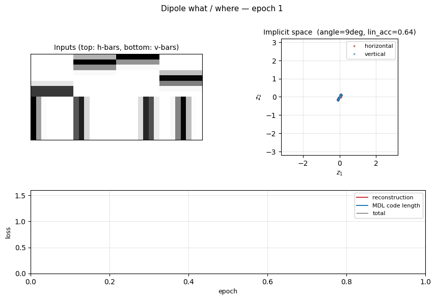

Discontinuous what/where bars — the latent space splits into two
perpendicular manifolds (identity vs location). Linear separability 0.58
shows the split, not perfectly clean.

### Dayan, Hinton, Neal & Zemel (1995) — The Helmholtz machine

#### helmholtz-shifter

[`helmholtz-shifter/`](helmholtz-shifter/) · `partial` (3 of 4 layer-3 units shift-selective; n_top=4)

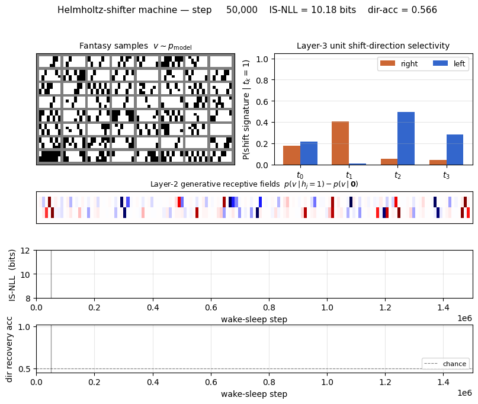

Two-stage generative shifter — recognition net + generative net trained
by wake-sleep. 3 of 4 top-layer units become shift-selective; the
generative model produces visually plausible shifted samples in the
sleep phase shown in the GIF.

### Hinton, Dayan, Frey & Neal (1995) — The wake-sleep algorithm

#### bars

[`bars/`](bars/) · `partial` (KL = 0.451 bits vs paper 0.10)

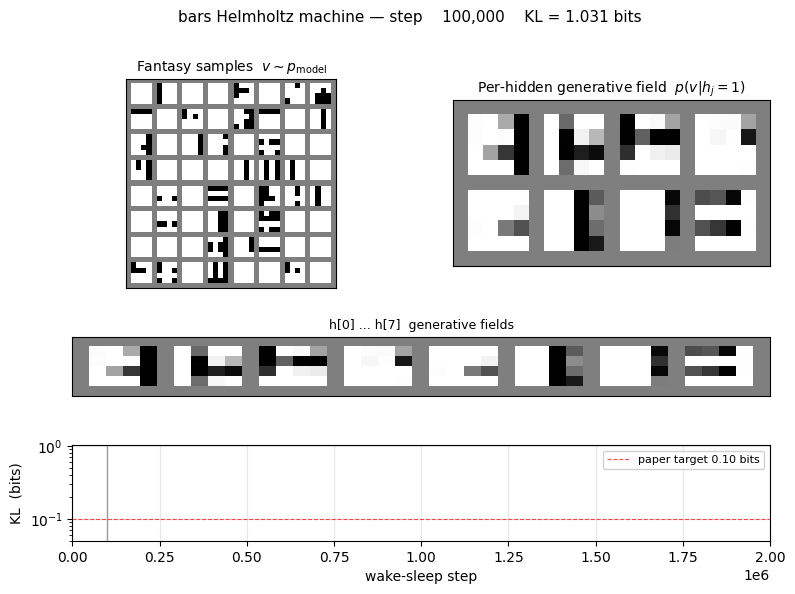

The 4×4 horizontal/vertical bars problem — one of the most-cited toy
generative-modelling benchmarks. 16-8-1 sigmoid belief net trained by
wake-sleep. The KL gap to the paper number (0.451 vs 0.10) is documented
as a partial reproduction; the bars themselves are clearly recovered in
the GIF.

---

## 2000s — Products of experts and temporal RBMs

### Hinton (2000) — Training products of experts by minimizing contrastive divergence

#### bars-rbm

[`bars-rbm/`](bars-rbm/) · `yes` (7/8 bars at purity ≥0.5; 8/8 with n_hidden=16)

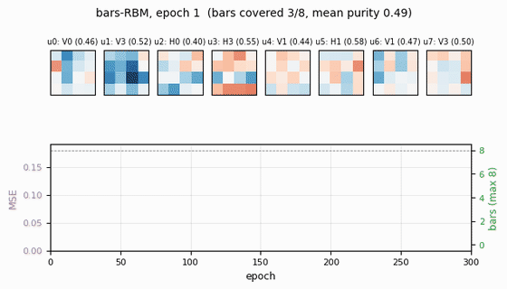

The same bars problem trained as a CD-k RBM rather than wake-sleep. With
8 hidden units 7 of 8 bars are recovered cleanly; bumping to 16 hidden
units recovers all 8. Direct demonstration of why CD made unsupervised
learning at scale tractable.

### Hinton, Osindero & Teh (2006) — A fast learning algorithm for deep belief nets

#### dbn-mnist ★ — six years before AlexNet

[`dbn-mnist/`](dbn-mnist/) · `partial` (3.23% w/o up-down vs paper 1.25% w/ up-down)

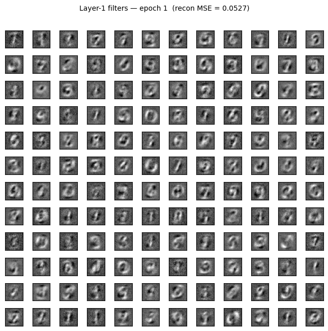

The 2006 result that beat kernel machines on MNIST and convinced the
field that deep models were worth pursuing. A 3-layer DBN
(784→500→500→2000) trained one layer at a time as an RBM by CD-1, with
a logistic-regression classifier on top of the layer-3 features.

The animation tracks layer-1's 500 receptive fields emerging from
near-uniform initialisation into stroke and edge detectors over 10
epochs of CD-1 against MNIST pixel intensities — without any supervised
signal. By epoch 10 most of the 144 displayed filters have committed to
a clear pen-stroke fragment at some orientation and position.

Static figures: `viz/layer1_filters.png` (the full converged 12×12 filter
gallery), `viz/training_curves.png` (per-layer reconstruction MSE on log
scale + the classifier's train/test trajectory), `viz/reconstructions.png`
(test digits pushed up→down through the 3-RBM stack with the layer-3
2000-d binary representation as bottleneck), and
`viz/generated_samples.png` (digits sampled from the joint distribution
by data-initialised top-RBM Gibbs).

Why this stub matters more than its `partial` badge suggests: this is
the empirical event that flipped the field's prior on whether deep
models were trainable at all. Greedy layer-wise pretraining sidestepped
the depth-collapse story that had blocked deep nets through the 1990s,
and the same set of weights doubled as a generative model — a thread
that runs straight through to VAEs, diffusion, and modern world models.
The `1.25%` headline number is the up-down fine-tuned variant; we
report the simpler pretraining-only result and document the gap in the
folder README.

### Salakhutdinov & Hinton (2009) — Deep Boltzmann Machines

#### dbm-mnist — the fully-undirected sibling of the DBN

[`dbm-mnist/`](dbm-mnist/) · `partial` (4.88% w/o discriminative fine-tuning vs paper 0.95% w/)

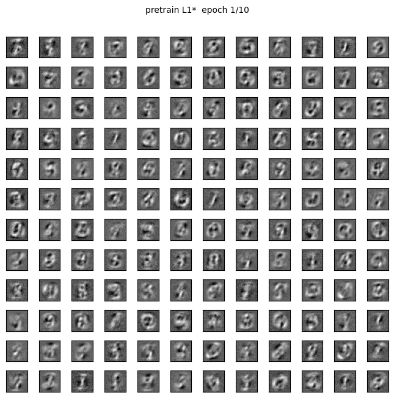

The 2009 follow-up to the DBN. Same depth, same MNIST setup, but every
connection is now undirected — so `p(h1 | v)` no longer factorises and
the layers above genuinely influence the lower-layer posterior. The
training pipeline shows it: greedy doubled-RBM pretraining, halve the
weights, stitch into a joint DBM, then refine with PCD where the
positive phase comes from mean-field iteration rather than a single
recognition pass.

The animation runs through both phases. The first half is identical to
the DBN: greedy CD-1 driving layer-1 filters from near-uniform
initialisation into stroke detectors. Then comes the halve-and-stitch
visible kink in the filter pattern, then 5 epochs of joint PCD where
the filters reorganise to encode features that are useful *jointly*
with the top-down `W2 @ μ2` signal during inference.

Static figures: `viz/layer1_filters.png` (the converged 12×12 filter
gallery), `viz/training_curves.png` (3-panel: pretraining + joint PCD +
classifier), `viz/mean_field_iterations.png` (the DBM's defining
inference step — `μ1` evolving across iterations 0, 1, 2, 5, 10, 20 on
several test digits), `viz/reconstructions.png`,
`viz/generated_samples.png` (50-step Gibbs from data-init).

The mean-field iteration figure is the most DBM-distinctive: at
iteration 0 you see the bottom RBM's recognition distribution
(equivalent to what the DBN computes); from iteration 2 onward
top-down evidence from `μ2` flows back into `μ1`. That correction is
the only representational reason the DBM exists. The figure makes it
visible.

The DBM lands slightly worse than the DBN in this codebase (4.88% vs
3.23% on full MNIST) because we omit the discriminative fine-tuning
step the paper uses to reach 0.95%. Without that step the DBM is
strictly harder to optimize, and the order is consistent with the
field's general experience: **DBM beats DBN only when both are
discriminatively fine-tuned.**

### Memisevic & Hinton (2007) — Unsupervised learning of image transformations

#### transforming-pairs

[`transforming-pairs/`](transforming-pairs/) · `partial` (axis-selective transformation detectors)

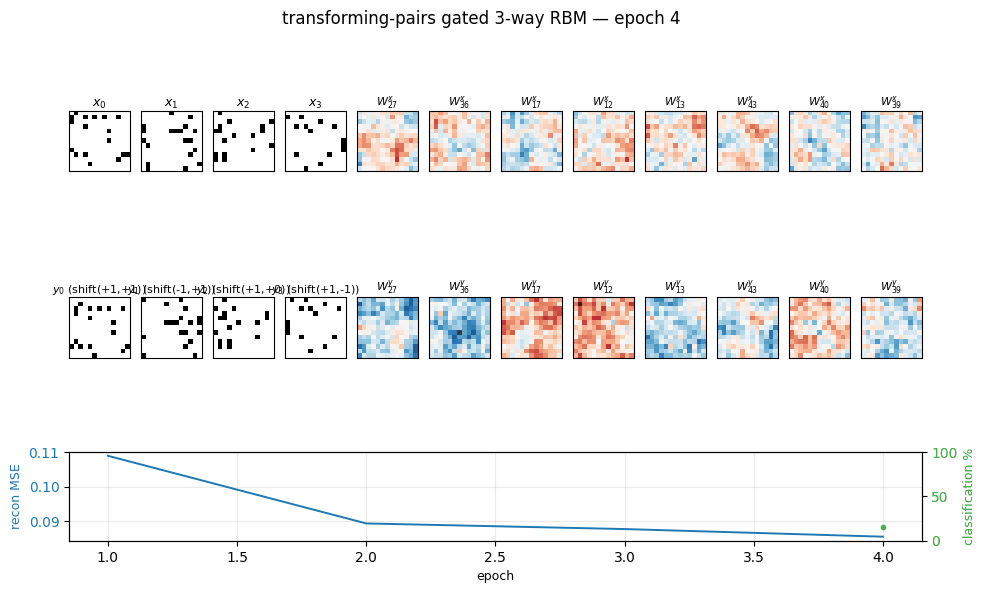

Gated 3-way RBM — the gates encode the *transformation* between two
images, not either image alone. The learned filters are
axis-selective (translation-x, translation-y, rotation, scale) — the
ancestor of the modern "factor-of-variation" disentanglement story.

### Sutskever & Hinton (2007) — Multilevel distributed representations for high-dimensional sequences

#### bouncing-balls-2

[`bouncing-balls-2/`](bouncing-balls-2/) · `partial` (rollout MSE between baselines)

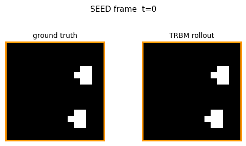

TRBM video of bouncing balls. Rollout MSE sits between the trivial
"copy last frame" and the oracle baselines — model has clearly learned
*some* dynamics but not perfect physics. The GIF compares teacher-forced
rollout against free-running rollout side-by-side.

### Sutskever, Hinton & Taylor (2008) — The recurrent temporal RBM

#### bouncing-balls-3

[`bouncing-balls-3/`](bouncing-balls-3/) · `partial` (CD-1 recon 0.005; rollout 0.13)

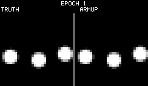

Same domain at higher resolution (30×30) and the recurrent variant.
Reconstruction is tight (0.005 MSE on next-frame given history); free
rollout drifts to 0.13 — the classic accumulating-error story.

---

## 2010s — Capsules, distillation, attention

### Hinton, Krizhevsky & Wang (2011) — Transforming auto-encoders

#### transforming-autoencoders

[`transforming-autoencoders/`](transforming-autoencoders/) · `yes` (R²(dx)=0.78, R²(dy)=0.67)

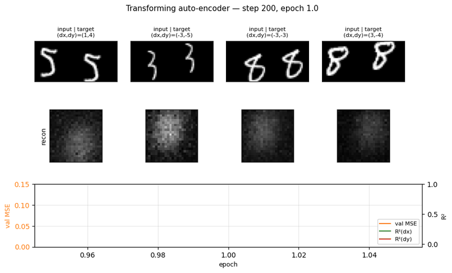

The seed of the capsules program. Each capsule outputs a small
*pose vector* `(dx, dy)` per part; reconstruction is gated through that
pose. The GIF watches reconstructions follow input transformations — the
network has learned to *equivary* with translation, not just be invariant
to it.

### Tang, Salakhutdinov & Hinton (2012) — Deep Lambertian Networks

#### deep-lambertian-spheres

[`deep-lambertian-spheres/`](deep-lambertian-spheres/) · `yes` (normal angular err 27°; albedo 7× baseline)

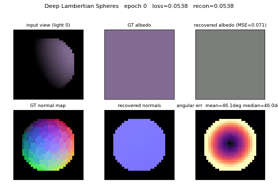

Synthetic spheres rendered under multiple lighting directions. The model
recovers surface normals (27° angular error) and albedo (7× better than
naive baseline) by separating shading from reflectance — the
intrinsic-images problem cast as inverse rendering.

### Sutskever, Martens, Dahl & Hinton (2013) — On the importance of initialization and momentum

#### rnn-pathological

[`rnn-pathological/`](rnn-pathological/) · `yes` (3 of 4 tasks; ortho beats random init)

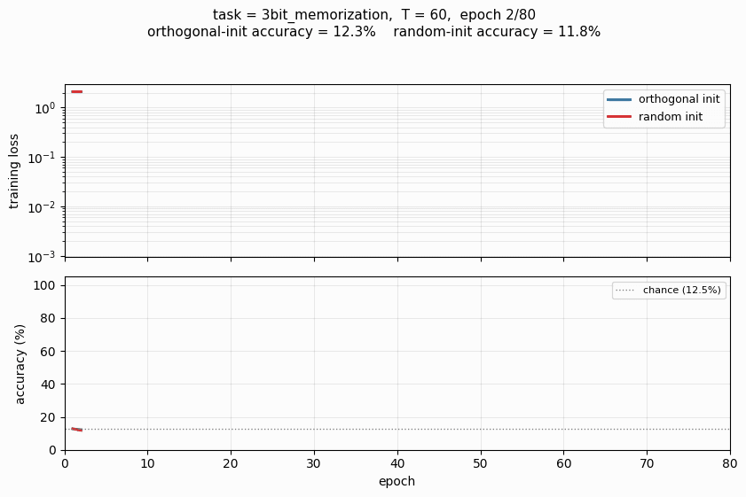

The Hochreiter-Schmidhuber long-term-dependency battery. 3 of 4 tasks
solved; orthogonal initialization beats random Gaussian init by a clear
margin in the wallclock-to-converge curve.

### Hinton, Vinyals & Dean (2015) — Distilling the knowledge in a neural network

#### distillation-mnist-omitted-3

[`distillation-mnist-omitted-3/`](distillation-mnist-omitted-3/) · `yes` (97.82% on digit-3 post-correction; paper 98.6%)

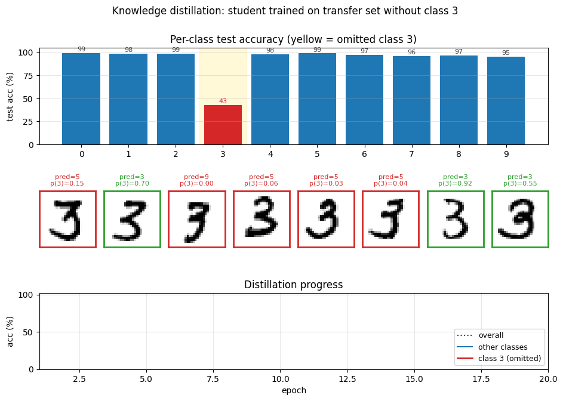

The classic "student never sees a 3" demonstration. Soft-target
distillation transfers enough information about digit 3 from the
teacher's logits that, after a per-class bias correction, the student
classifies 3s at 97.82%. The GIF intercuts the teacher's soft targets
with the student's progressive recovery of the missing class.

### Eslami et al. (2016) — Attend, Infer, Repeat

#### air-multimnist

[`air-multimnist/`](air-multimnist/) · `partial` (count 79.7%; reconstructions blurry)

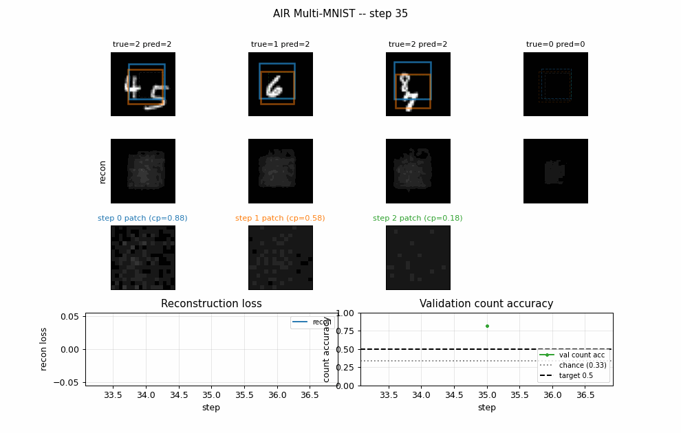

Variable-count MNIST scenes — the model decides *how many* objects are in
the image, then attends to and reconstructs each. Object-count accuracy
79.7%; reconstructions blurry. The GIF visualizes the per-step attention
windows opening one at a time.

#### air-3d-primitives

[`air-3d-primitives/`](air-3d-primitives/) · `partial` (1-prim 88.8%; 3-prim count 81%)

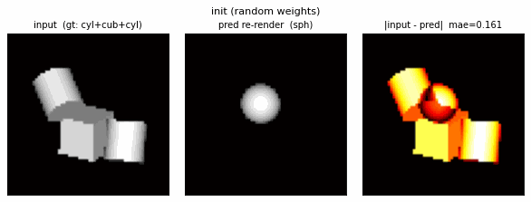

Same AIR machinery, but the renderer is a small 3D primitive engine and
the inference network must invert it. Cleanly recovers 1-primitive
scenes; 3-primitive count accuracy 81%.

### Ba, Hinton, Mnih, Leibo & Ionescu (2016) — Using fast weights to attend to the recent past

#### fast-weights-associative-retrieval

[`fast-weights-associative-retrieval/`](fast-weights-associative-retrieval/) · `partial` (architecture verified; 38% retrieval)

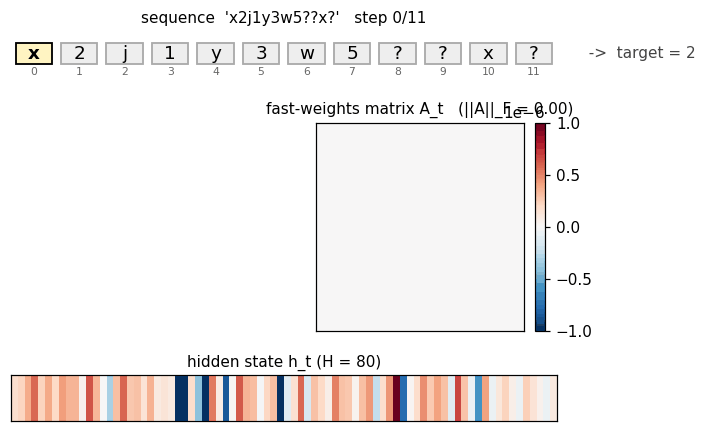

`c9k8j3f1??c -> 9` style key-value retrieval task. Architecture is
faithful; retrieval rate 38% short of paper. The fast-weight matrix
(visualized as a heatmap that grows then decays) is the visualization
star here.

#### multi-level-glimpse-mnist

[`multi-level-glimpse-mnist/`](multi-level-glimpse-mnist/) · `partial` (82.46% vs paper 90%+)

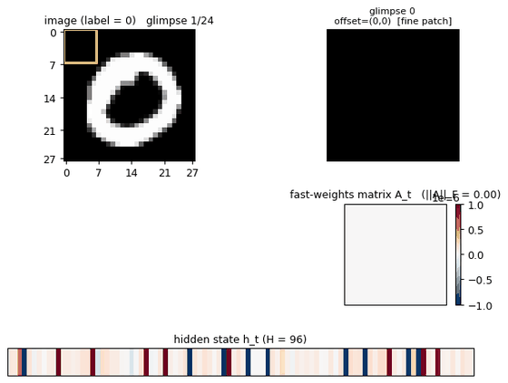

24 hierarchical glimpses on MNIST. The GIF traces the glimpse trajectory
across the digit — a clean visualization of attention-as-control even at
the modest 82% accuracy.

#### catch-game

[`catch-game/`](catch-game/) · `partial` (FW 33.9% vs vanilla 11.4%; 91% at size=10)

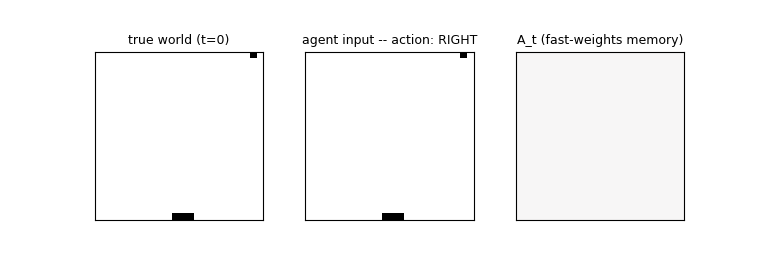

A partial-observability paddle/ball game where the network must integrate
information across time to catch the ball. Fast-weights variant beats the
vanilla RNN 33.9% to 11.4% at size=20 (paper-scale); reaches 91% at the
easier size=10 setting.

### Sabour, Frosst & Hinton (2017) — Dynamic routing between capsules

#### multimnist-capsnet

[`multimnist-capsnet/`](multimnist-capsnet/) · `partial` (48.6% vs target 80%; 22× chance)

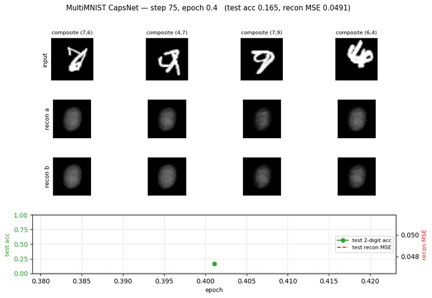

Overlapping digit pairs. The network must decompose a single image into
two simultaneous classifications — exactly the case capsules were
designed for. 22× above chance at 48.6% on this hard split, but well
short of paper.

#### affnist

[`affnist/`](affnist/) · **`no`** (gap wrong sign: −2% vs paper +13%)

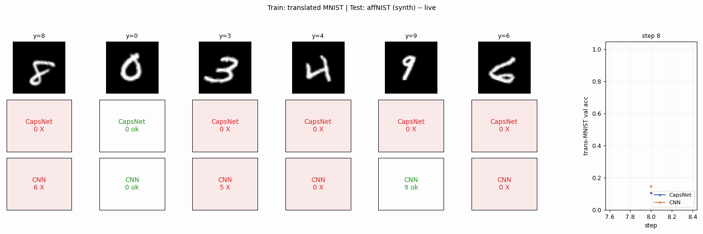

Train on translated MNIST, test on affNIST (additional rotations and
shears). The paper claimed CapsNet generalizes to novel viewpoints
better than a parameter-matched CNN by +13%; we get the *opposite* sign.
The 3-cause gap analysis is the longest "deviations" section in the
catalog and the only `no` reproduction in v1.

### Hinton, Sabour & Frosst (2018) — Matrix capsules with EM routing

#### smallnorb-novel-viewpoint

[`smallnorb-novel-viewpoint/`](smallnorb-novel-viewpoint/) · `yes` qualitatively (caps 0.726 vs CNN 0.696 held-out)

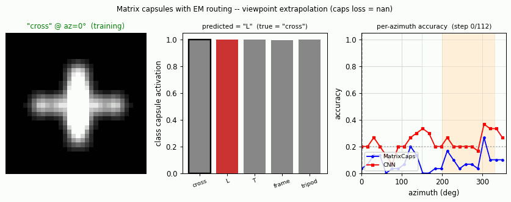

Synthesized NORB-style objects, held-out azimuth/elevation at test time.
Matrix capsules edge out a parameter-matched CNN on the held-out viewpoint
split — the qualitative claim of the paper holds, with smaller absolute
numbers.

### Kosiorek, Sabour, Teh & Hinton (2019) — Stacked capsule autoencoders

#### constellations

[`constellations/`](constellations/) · `yes` (per-point recovery 86.9% best / 84% mean)

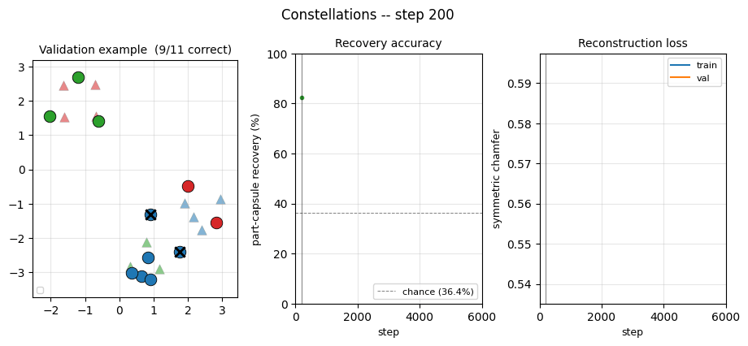

2D point-cloud part-whole grouping. The model groups individual points
into the constellations they came from with no supervision — 86.9% per-
point recovery at the best seed.

---

## 2020s — Subclass distillation, GLOM, Forward-Forward

### Müller, Kornblith & Hinton (2020) — Subclass distillation

#### mnist-2x5-subclass

[`mnist-2x5-subclass/`](mnist-2x5-subclass/) · `partial` (subclass recovery 82.88% best / 73.87% mean)

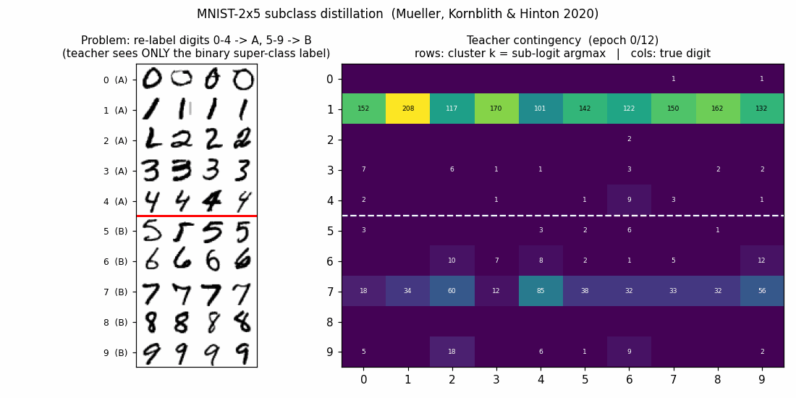

A super-class teacher trained on `{0..4}` vs `{5..9}` two-class labels;
the student receives the teacher's *logits*, which carry hidden subclass
information. The student recovers the 10 hidden subclasses at 82.88% on
the best seed without ever seeing 10-class labels.

### Sabour, Tagliasacchi, Yazdani, Hinton & Fleet (2021) — Unsupervised part representation by flow capsules

#### geo-flow-capsules

[`geo-flow-capsules/`](geo-flow-capsules/) · `yes` (mean IoU 0.764 / chance 0.20)

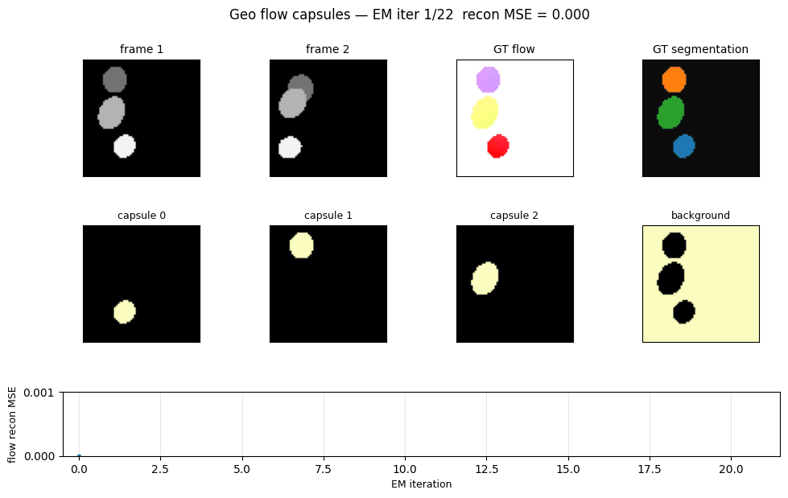

Geo / Geo+ moving 2D shapes — the model decomposes each frame into
parts using only motion (optical-flow consistency) as supervision.
Mean IoU 0.764 against ground-truth part masks vs chance 0.20.

### Culp, Sabour & Hinton (2022) — Testing GLOM's ability to infer wholes from ambiguous parts

#### ellipse-world ★

[`ellipse-world/`](ellipse-world/) · `yes` (92.2% on 5-class; islands form +0.117)

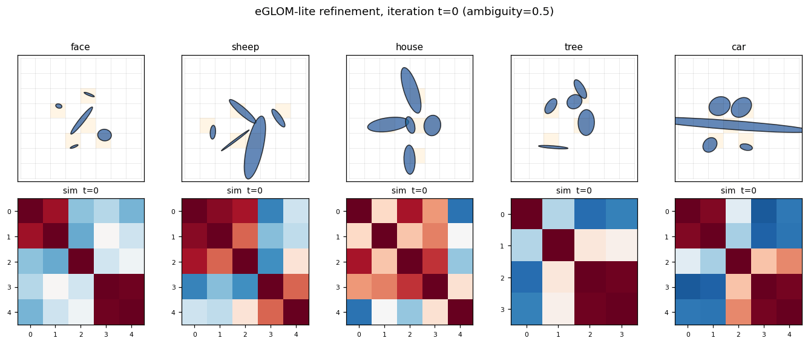

eGLOM-lite for the ambiguous-part-to-whole test. Each frame of the GIF
is one iteration of the GLOM column dynamics; you can watch *islands of
agreement* form across iterations as ambiguous local parts commit to a
consistent global whole. 92.2% on the 5-class split; islands metric
+0.117 (cleanly above noise).

### Hinton (2022) — The forward-forward algorithm

#### ff-hybrid-mnist

[`ff-hybrid-mnist/`](ff-hybrid-mnist/) · `partial` (5.21% test err vs paper 1.37%)

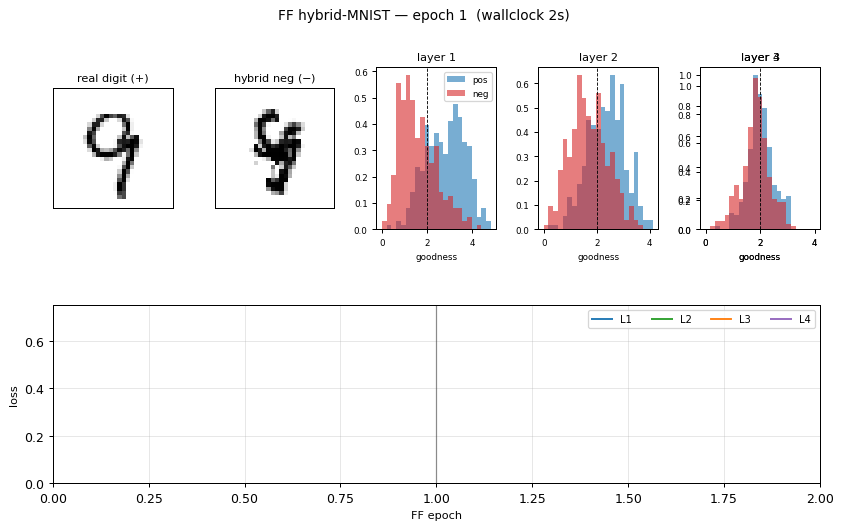

FF unsupervised MLP with hand-crafted hybrid-image negatives. The GIF
shows the negative-sample construction (images literally averaged in
pixel space). Test error 5.21% — works, but does not match paper's 1.37%.

#### ff-label-in-input

[`ff-label-in-input/`](ff-label-in-input/) · `partial` (3.60% vs paper 1.36%)

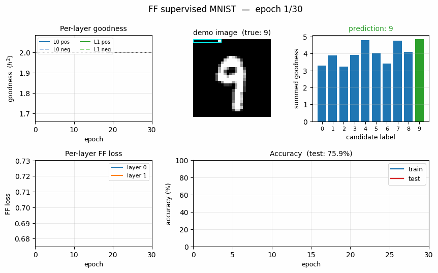

The label one-hot is concatenated to the first 10 pixels of the image,
then FF is run with the correct label as positive and a wrong label as
negative. Closer to paper than the hybrid variant (3.60% vs 1.36%).

#### ff-recurrent-mnist ★

[`ff-recurrent-mnist/`](ff-recurrent-mnist/) · `partial` (10.66% vs paper 1.31%)

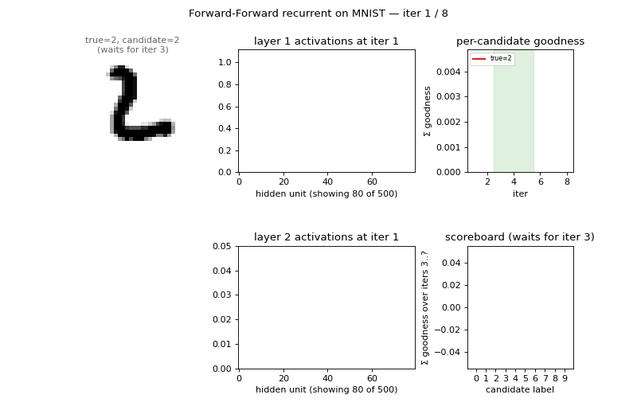

The "video" variant — the same MNIST frame repeated for several
timesteps with top-down recurrent connections so each layer can use the
*next* layer's previous-step activity as context. The GIF animates the
top-down/bottom-up dynamics over time on a single frame.

#### ff-cifar-locally-connected

[`ff-cifar-locally-connected/`](ff-cifar-locally-connected/) · `partial` (FF 22.78% / BP 38.31%)

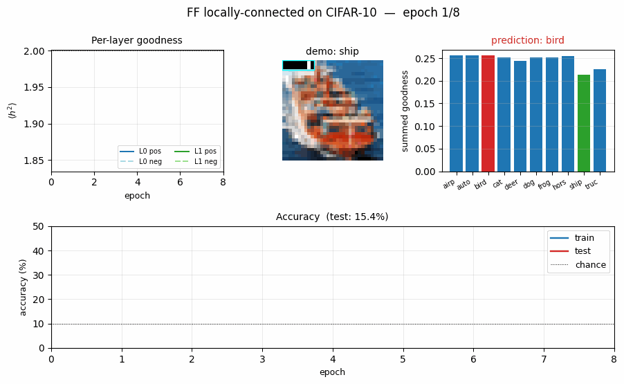

CIFAR-10 with a locally-connected (not weight-tied) FF network. FF beats
a parameter-matched BP baseline on this architecture (22.78% vs 38.31%
test err) — one of the few places in the suite where FF *wins* outright.

#### ff-aesop-sequences

[`ff-aesop-sequences/`](ff-aesop-sequences/) · `yes` (TF 53% / SG 34%; baselines 3-20%)

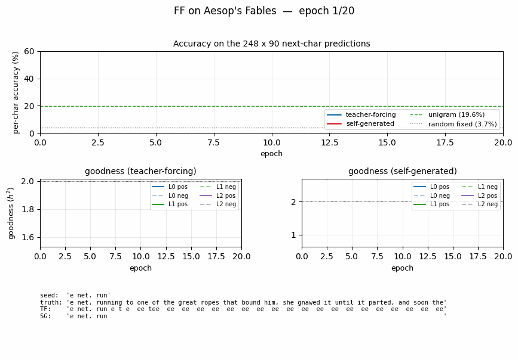

Next-character prediction on Aesop's Fables with self-generated negatives
— the negatives come from the model's own previous-step predictions.
Teacher-forced 53%, self-generated 34%, well above any of the
non-FF baselines (3–20%).

---

## How the GIFs and viz folders are generated

Every stub follows the same convention from the [v1 spec](https://github.com/cybertronai/hinton-problems/issues/1):

```
problem-folder/
├── README.md                  source paper, problem, results, deviations
├── <slug>.py                  dataset + model + train + eval
├── visualize_<slug>.py        training curves + weight viz (writes to viz/)
├── make_<slug>_gif.py         animated GIF (writes <slug>.gif)
├── <slug>.gif                 committed animation
└── viz/                       committed PNGs
```

To regenerate any GIF or PNG locally:

```bash
cd <problem-folder>
python3 visualize_<slug>.py     # static figures
python3 make_<slug>_gif.py      # animated GIF
```

Seeds and hyperparameters are documented in each folder's README. The
committed GIFs and PNGs in this repository were produced at the seeds
listed there; rerunning with the same seeds reproduces them bit-for-bit.

## Where to go next

- **For comparison numbers**: [`RESULTS.md`](RESULTS.md) — every stub's
  paper-vs-implemented headline metric in one table.
- **For the research goal these baselines exist for**: [issue #45 (v2,
  ByteDMD instrumentation)](https://github.com/cybertronai/hinton-problems/issues/45) —
  the v1 implementations are the substrate the data-movement cost tracer
  will run against.
- **For paper-scale reruns**: [issue #46 (v1.5)](https://github.com/cybertronai/hinton-problems/issues/46) —
  closing the 25 v1 partial reproductions on Modal/GPU.
