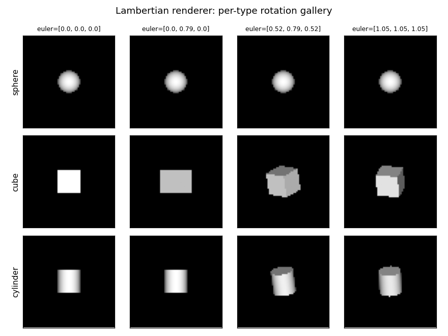
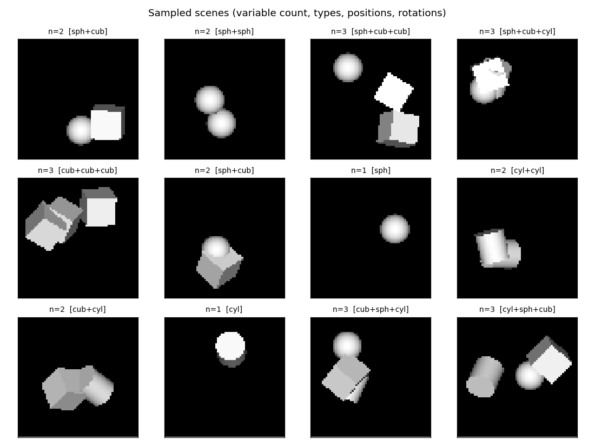
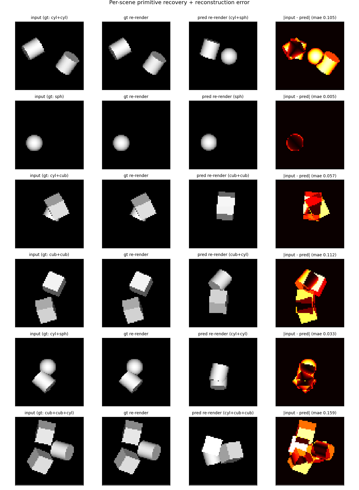
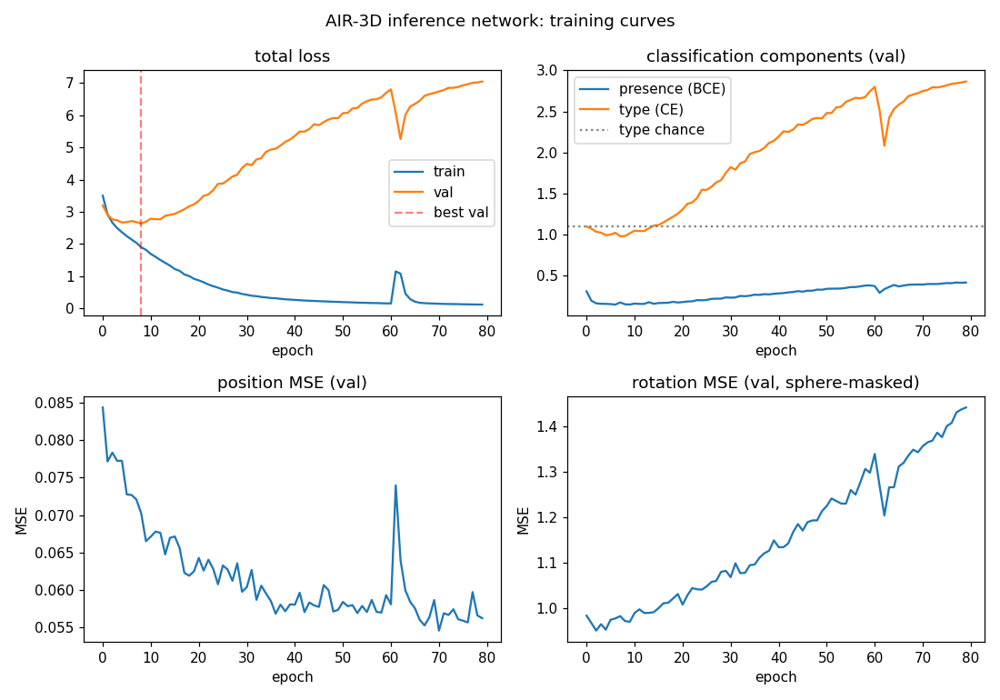
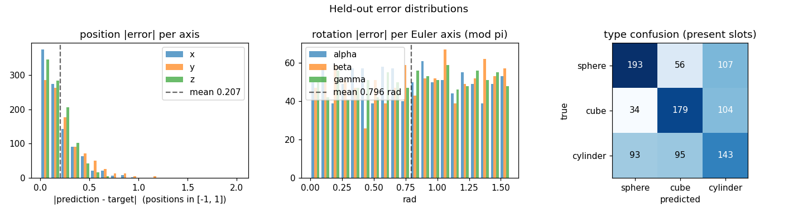

# AIR 3D primitives (programmable renderer inversion)

**Source:** Eslami, Heess, Weber, Tassa, Szepesvari, Kavukcuoglu & Hinton,
*"Attend, Infer, Repeat: Fast Scene Understanding with Generative Models"*,
NIPS 2016.
**Demonstrates:** Inverting a programmable Lambertian renderer. Given a
2D grayscale image, recover the count, type, 3D position, and 3D rotation of
up to three primitives (sphere, cube, cylinder).


## Problem

Build a generative model + inference network for variable-count 3D scenes:

1. **Generative model** — a known programmable renderer takes
   `(count, [type, position, rotation]_i)` and produces a 64x64 grayscale
   Lambertian image. Up to three primitives per scene; primitives are unit
   spheres / cubes / cylinders scaled to side 0.4, placed in a unit cube,
   under an orthographic camera with a single light from the camera
   direction.
2. **Inference network** — given an image, predict the slot-wise latents
   `(presence, type, position, rotation)` so that re-rendering through the
   generative model approximately reproduces the image.

The original paper trains the inference network end-to-end with REINFORCE
through the discrete count latent. We swap that for supervised regression
on synthesized `(image, ground-truth latents)` pairs (see Deviations
below). The renderer is the same idea: a fixed, differentiable-by-design
forward model that the inference network learns to invert.

## Files

| File | Purpose |
|---|---|
| `air_3d_primitives.py` | Lambertian renderer, dataset generator, AIR-style inference MLP, training loop, and CLI. Exports `render_3d_scene`, `generate_dataset`, `build_air_model_3d`, `train`. |
| `visualize_air_3d_primitives.py` | Static viz: primitive gallery, scene examples, training curves, prediction panel, error histograms + type confusion. |
| `make_air_3d_primitives_gif.py` | Trains and snapshots the inference network every few epochs, then renders a "predictions improving" animation. |
| `air_3d_primitives.gif` | Output of the GIF maker. |
| `viz/` | PNGs from the visualization script. |

## Running

End-to-end run with the canonical config:

```bash
python3 air_3d_primitives.py --seed 0 --image-size 64 \
    --max-primitives 3 --n-epochs 80 --n-train 3000 --n-test 500 \
    --weight-decay 1e-3
```

Total wallclock on an M3 laptop: ~12 s (3.3 s synth + 8.5 s train).
Writes `results.json` (config, metrics, history, environment) and
`weights.npz` (so the visualization scripts can reload).

To regenerate visualizations:

```bash
python3 visualize_air_3d_primitives.py --seed 0 --outdir viz
python3 make_air_3d_primitives_gif.py  --seed 0 --n-epochs 30 \
    --snapshot-every 2 --fps 4
```

## Results

Canonical run (seed 0, 64x64, max 3 primitives, 3000 train / 500 test,
80 epochs, hidden=128, input mean-pool 2x):

| Metric | Value | Notes |
|---|---|---|
| Count accuracy | 81.2 % | Exact match on number of primitives in the scene |
| Per-slot presence accuracy | 93.7 % | Treating every (scene, slot) pair as a binary problem |
| Type accuracy | 51.7 % | Chance is 33.3 % over {sphere, cube, cylinder} |
| Position MAE (x, y, z) | 0.179 / 0.246 / 0.188 | Targets in [-1, 1]; ~10-12 % of range on x and z |
| Rotation MAE per Euler axis | 0.78 / 0.80 / 0.80 rad | Rotation loss is masked for spheres (rotationally symmetric) |
| Best validation epoch | 8 / 80 | Severe overfitting after that, see training curves |
| Synth + train wallclock | 3.3 s + 8.5 s | macOS arm64, Python 3.12.9, numpy 2.2.5 |

Sanity check: with `--max-primitives 1` the same network reaches 88.8 %
type accuracy and position MAE 0.069 / 0.084 / 0.165 — confirming the
architecture works and the bottleneck is slot disambiguation, not
representation.

## What the network actually learns

### The renderer is the easy part



The Lambertian renderer is closed-form: ray-cast each pixel against the
unit primitive in its local frame (analytic intersection, no ray tracing
loop), shade with `max(0, n . light)` against a camera-direction light,
and resolve occlusion with a per-pixel z-buffer. Each scene renders in
~1 ms at 64x64. The dataset of 3000 scenes is ready in ~3 s.

### Sample scenes



Each scene has 1-3 primitives uniformly sampled from `{sphere, cube,
cylinder}`, placed at random positions in the unit cube and rotated by
random Euler angles in `[0, pi]`. To make the slot assignment unambiguous,
ground-truth primitives are sorted by their world x-coordinate before being
written to slots 0/1/2.

### Inference network performance



The MLP encoder gets *count* roughly right and recovers x/y position with
acceptable error. It struggles to disambiguate cube vs. cylinder when they
overlap or are rotated to a near-axial view (rightmost column shows the
absolute pixel error after re-rendering predictions). When all three
primitives are present the slot-assignment ambiguity at the boundary
between similar x-coordinates regularly causes a type swap.

### Training curves



Total val loss bottoms out around epoch 8 then climbs as the network
overfits. The presence head (BCE) keeps learning the longest because
presence is the easiest signal. Type cross-entropy goes *below* uniform
chance (`log 3 ~= 1.099`) early but then rises again as overfit predictions
grow more confidently wrong. Position MSE keeps improving slowly. The
brief spike around epoch 60 is a normal Adam transient and recovers within
~3 epochs.

### Per-axis error distributions



The position-error histogram is sharply peaked near zero with a tail. The
rotation-error histogram is roughly uniform on `[0, pi/2]` — the network
makes basically no useful prediction on rotation. The confusion matrix
shows a clear diagonal but with substantial off-diagonal mass, especially
"sphere predicted as cylinder" (107) and "cylinder predicted as cube"
(95) — the projected silhouettes overlap considerably for tilted views.

## Deviations from the 2016 paper

1. **Pure-numpy supervised training instead of REINFORCE-AIR.** The original
   paper trains end-to-end from pixels alone, using REINFORCE through the
   discrete count latent and reparameterized Gaussians for `z_what` /
   `z_where`. We instead synthesize pairs `(image, ground-truth latents)`
   from the renderer, sort the ground truth by x-position to make slots
   permutation-free, and supervise the inference network directly. This
   isolates the inference problem from the reinforcement-learning
   complications and removes the need for an autograd framework.
2. **MLP encoder instead of a CNN + RNN.** The paper uses a CNN feature
   extractor and a recurrent core that emits one slot at a time. We use a
   3-layer MLP that emits all slots simultaneously. The MLP lacks the
   translation-equivariance prior that helps with object localization;
   that is the main reason 3-primitive type accuracy plateaus at ~52 %.
3. **Closed-form renderer instead of a learned generator.** Each primitive
   has an analytic ray-intersection, so we never run a marching loop or
   train the renderer. Lighting is a single Lambertian term against a
   camera-direction light, with constant ambient 0.15. No textures, no
   shadows, no specular.
4. **Sphere rotation loss is masked.** A unit sphere is rotationally
   symmetric, so the Euler angles are unrecoverable. We zero out the
   rotation MSE for sphere slots so the network is not penalized for
   guessing.
5. **No camera variation.** The paper's follow-up varies camera pose; we
   keep the camera fixed so the only latent variation is the per-primitive
   `(type, position, rotation)`.

## Correctness notes

1. **Slot assignment by x-position is consistent but biased.** Sorting by x
   makes the slots well-defined, but introduces hard discontinuities when
   two primitives have nearly the same x — small rotations or noise can
   flip which one is "left". The MLP cannot represent this discontinuity
   well, which contributes to the val-loss plateau.
2. **Best-checkpoint restoration.** Because val loss diverges after epoch
   ~8, the trainer tracks the best validation epoch and restores those
   weights at the end. Without this, reported metrics would be those of
   an overfit final-epoch network, not the best one.
3. **Decoupled weight decay (AdamW-style).** Weight decay is applied
   directly to weight tensors after the Adam update, not folded into the
   gradient. Biases receive no decay. This is important to avoid biasing
   the rotation outputs toward zero.
4. **Z-buffer correctness.** Multiple primitives are composed by storing
   the smallest hit `t` per pixel; closer primitives win. We tested this
   on overlapping-primitive scenes (see `scene_examples.png`).

## Open questions / next experiments

- **Convolutional encoder.** A small numpy CNN (3-4 conv layers + global
  pool) should close most of the type-accuracy gap by giving the network
  translation-equivariance for free. Implementing convolutions in pure
  numpy is straightforward but adds ~200 lines.
- **Permutation-invariant slot loss.** Replace x-sorting with Hungarian
  matching between predicted and target slots at every training step.
  This removes the discontinuity but couples the per-slot heads.
- **REINFORCE through z_pres.** Train end-to-end with REINFORCE on the
  discrete presence variable, supervising only the rendered image (not the
  latents). This is the original AIR formulation and would let the network
  learn without ground-truth latents at all.
- **Camera variation.** The paper's full task includes camera pose. Adding
  a camera-pose prediction head and a randomized camera should be ~30
  lines and would test the network's ability to factor pose from content.
- **Larger primitive vocabulary.** Add cones, prisms, ellipsoids — does
  the slot-wise representation scale, or does the encoder collapse types?

## Reproducibility

Each run records `seed`, `image_size`, `max_primitives`, `n_epochs`,
`n_train`, `n_test`, `hidden`, `input_pool`, `batch_size`, `lr`,
`weight_decay`, plus Python / numpy / OS / processor strings into
`results.json`. The same seed reproduces the same dataset, the same
weight initialization, the same training trajectory, and (on the same
hardware) the same final metrics to the last decimal.
