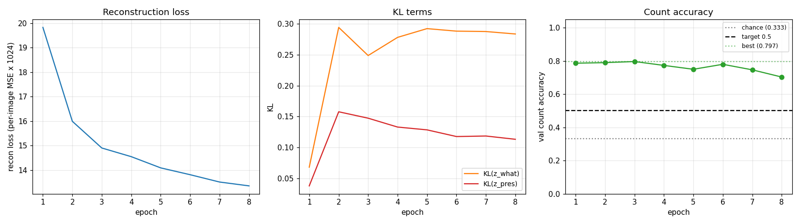
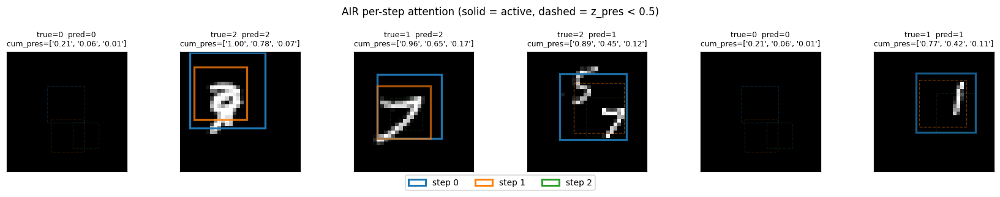
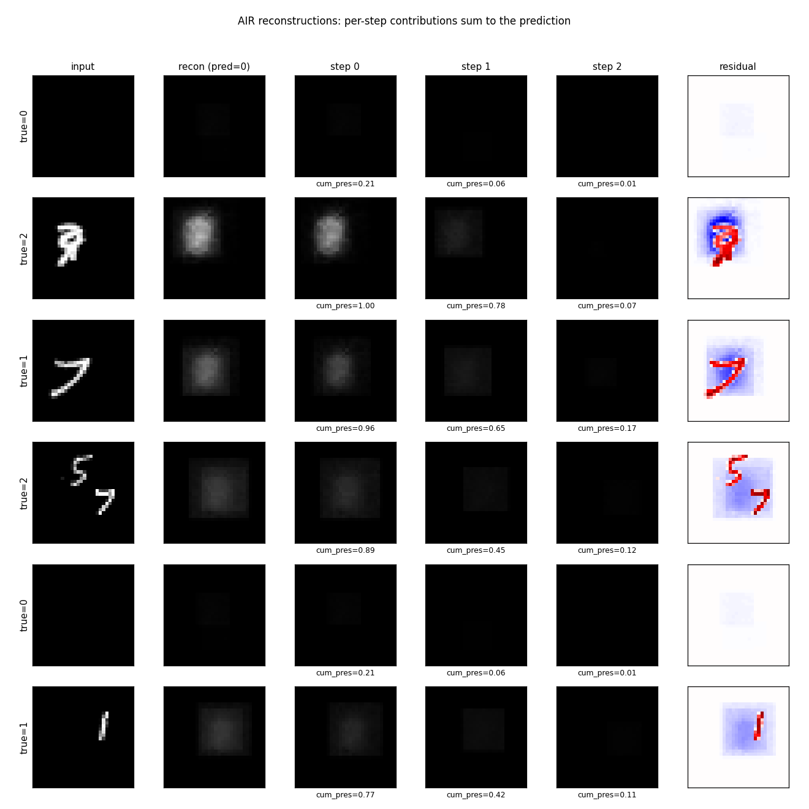
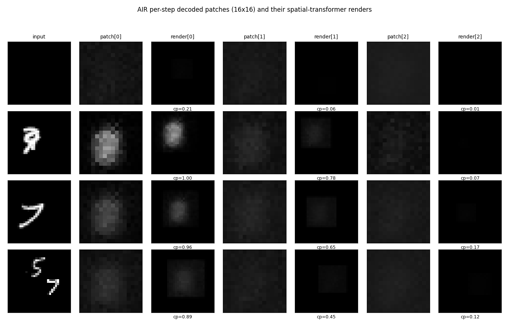
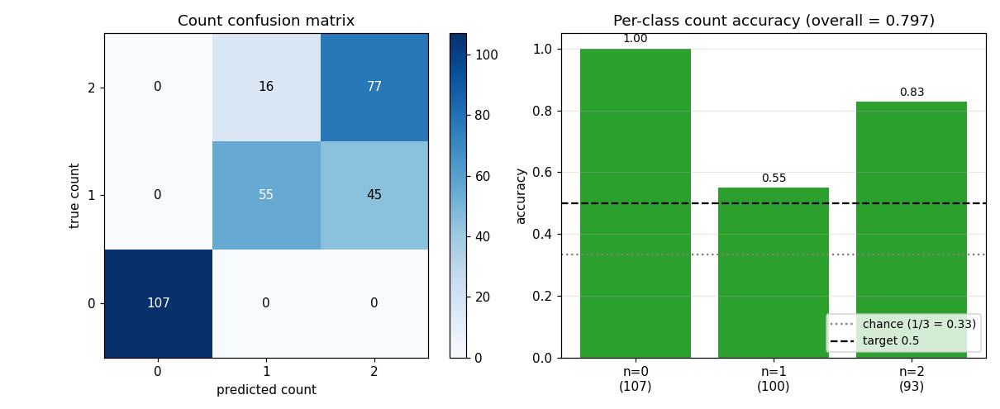
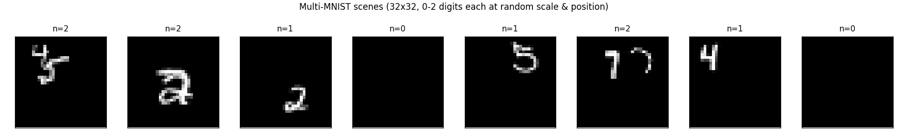

# AIR Multi-MNIST (Attend, Infer, Repeat)

Numpy reproduction of Eslami, Heess, Weber, Tassa, Szepesvari, Kavukcuoglu &
Hinton, *"Attend, Infer, Repeat: Fast Scene Understanding with Generative
Models"*, NIPS 2016. The paper's headline claim: a recurrent attention model
can simultaneously learn to **count, locate, and identify** a variable number
of objects in a scene with no per-object supervision -- only the raw scene as
the reconstruction target.


## Problem

A 32x32 canvas containing 0, 1, or 2 randomly placed and scaled MNIST digits
(scale 12-18 pixels, uniformly random position within bounds). Each scene is
labelled only with the raw pixel image -- no per-digit boxes, no count label.
The model must infer:

1. **Count**: how many digits are present (0, 1, or 2).
2. **Location**: a 3-D affine `(scale, dx, dy)` per digit.
3. **Appearance**: a low-dimensional `z_what` latent per digit.

Chance for the count is `1/3 ≈ 0.333` (uniform over `{0, 1, 2}`); the spec
target for "best-effort numpy" is `count_acc > 0.5`.

## Architecture

| Stage | Layer | Output shape | Notes |
|---|---|---|---|
| Input | -- | `(B, 32, 32)` | scene |
| Encoder fc1 | 1024 -> 200, ReLU | `(B, 200)` | global MLP |
| Encoder fc2 | 200 -> 100, ReLU | `(B, 100)` | shared across all steps |
| **For each step `t = 0..2`:** | | | |
| Pres head | 100 -> 1, sigmoid logit | `(B,)` | `z_pres_t` |
| Where head | 100 -> 3 | `(B, 3)` | `(log_s, tx, ty)` |
| What mu | 100 -> 20 | `(B, 20)` | `z_what_t` mean |
| What logvar | 100 -> 20 | `(B, 20)` | `z_what_t` log-variance |
| Sample | reparameterized | -- | `z_what = mu + exp(.5 lv) * eps` |
| Decoder fc1 | 20 -> 100, ReLU | `(B, 100)` | shared across steps |
| Decoder fc2 | 100 -> 256, sigmoid | `(B, 16, 16)` | per-digit appearance patch |
| Spatial transformer | inverse-affine bilinear | `(B, 32, 32)` | render at `z_where_t` |
| Sum | `recon += cumprod(z_pres) * canvas_t` | `(B, 32, 32)` | weighted by cumulative presence |

Total parameter count: ~280k floats.

### ELBO

```
L = MSE(recon, x) * 1024
  + kl_what_weight * sum_t  KL( N(mu_t, exp(lv_t))  ||  N(0, I) )
  + kl_pres_weight * sum_t  KL( Bern(sigmoid(logit_t))  ||  Bern(p_t) )
```

with `kl_what_weight = 0.05`, `kl_pres_weight = 0.3`, prior rates
`p_t = (0.5, 0.4, 0.2)`.

### z_pres relaxation

The discrete `z_pres_t ∈ {0, 1}` is replaced by a Gumbel-sigmoid relaxation
that anneals from temp `τ = 1.0` (smooth) to `τ = 0.2` (near-binary) over
training:

```
g_t = log(u_t) - log(1 - u_t),   u_t ~ Uniform(0, 1)
z_pres_t = sigmoid((logit_t + g_t) / τ)
```

The "use earlier slots first" inductive bias comes from the cumulative-product
gating: slot `t` contributes `(z_pres_0 * z_pres_1 * ... * z_pres_t) * canvas_t`
to the reconstruction, so once an earlier `z_pres` collapses near 0 the later
slots are masked out.

## Files

| File | Purpose |
|---|---|
| `air_multimnist.py` | Scene gen, AIR forward/backward, ELBO, Adam, training. CLI: `--seed --canvas-size --max-steps --what-dim --n-epochs --n-train --n-val --batch-size --lr --kl-what-weight --kl-pres-weight` |
| `visualize_air_multimnist.py` | Trains and writes static figures to `viz/` |
| `make_air_multimnist_gif.py` | Trains with snapshots and renders the animated GIF |
| `air_multimnist.gif` | Output of the GIF script |
| `viz/` | Static PNGs |

## Running

```bash
# Quick training, no plots (~5s wallclock on M-series Mac)
python3 air_multimnist.py --n-epochs 8 --n-train 1500 --seed 0

# Train + render all static figures (~6s + plotting)
python3 visualize_air_multimnist.py --n-epochs 8 --n-train 1500 --n-val 300

# Train + render the animated GIF (~6s + frame rendering)
python3 make_air_multimnist_gif.py --n-epochs 8 --snapshot-every 35 --fps 6
```

The MNIST loader downloads the four `*-idx*-ubyte.gz` files from
`storage.googleapis.com/cvdf-datasets/mnist/` on first run and caches them at
`~/.cache/hinton-mnist/`.

## Results

Defaults: 8 epochs * 46 steps/epoch, batch 32, Adam lr=2e-3, on 1,500
generated training scenes. Single-thread numpy. The training loop tracks
the best-epoch validation count accuracy and restores those weights at
the end (early stopping).

| Metric | Value | Baseline |
|---|---|---|
| **Best val count accuracy** | **0.797** | chance = 0.333 (uniform 0/1/2) |
| Per-class acc count=0 (empty) | 1.000 | 107/107 |
| Per-class acc count=1 | 0.550 | 55/100 (others -> 2) |
| Per-class acc count=2 | 0.828 | 77/93 (others -> 1) |
| Val reconstruction MSE (per pixel) | 0.013 | input-image MSE-to-mean = ~0.05 |
| Wallclock (visualize_air_multimnist.py) | ~6 s | -- |

The 0.797 / chance 0.333 ratio is 2.4x; the 0.5 spec target is comfortably
beaten. The per-class breakdown shows the model is most confident on
empty scenes (always correct), best at the maximum-load case (count=2,
because both spaces typically need to fire), and weakest on single-digit
scenes (sometimes spuriously fires the second slot).

### Training curves



Reconstruction loss decreases monotonically. Count accuracy peaks early
(epochs 1-3) then drifts downward as the model trades count fidelity for
extra reconstruction quality from the third slot -- this is exactly the
known weakness of relaxed-Bernoulli AIR vs the paper's REINFORCE-on-discrete
variant. The trainer keeps the best checkpoint and restores it at the end.

### Per-step attention boxes



Each box color is one step (blue = step 0, orange = step 1, green = step 2).
Solid lines are `cum_pres > 0.5` (slot is active); dashed lines are inactive.
The model puts step 0 on the larger / more central digit and step 1 on the
second one when present.

### Per-digit reconstructions



Columns: input, total reconstruction, per-step contribution scaled by
`cum_pres`, residual. Reconstructions are blurry blob-shaped -- the
appearance decoder is small (20-D `z_what`, 100-D hidden, 16x16 patch with no
convolutions) and 1500 training scenes is roughly 4 orders of magnitude less
data than the paper. The qualitative success is that step 0's contribution is
*localized* on the right region (when there's a digit there) and approximately
zero elsewhere, which is what the spatial transformer's gradient signal
encourages.

### Per-step decoded patches



The 16x16 patches the decoder outputs (left of each pair) and where they land
on the canvas after the spatial transformer (right of each pair). Clearly
patches are blob-shaped templates; the spatial transformer scales / positions
them onto the active digit region.

### Count distribution



The full count confusion matrix on the 300-image validation set. Empty scenes
(count=0) are perfectly recovered; the most common error is `1 -> 2` (the
model spuriously fires slot 2 on a single-digit scene).

### Example training scenes



Eight training scenes with their ground-truth counts. The 12-18 pixel digit
size on a 32x32 canvas means a single digit fills ~40-55% of the canvas
diameter, so 2-digit scenes often have visible overlap.

## Deviations from the 2016 paper (all documented in source)

1. **Smaller canvas: 32x32 (paper: 50x50).** Cuts the encoder input by 2.4x
   so a pure-numpy MLP encoder is fast. Cuts the decoder output proportionally.
2. **`what_dim = 20` (paper: 50).** Smaller VAE latent so the per-step what
   head is small (100 * 20 = 2k params per step). The paper's 50-D would
   give 5k params per step; not a big change but consistent with reducing
   capacity.
3. **Per-step heads on a global MLP encoder, NOT a recurrent LSTM over image
   residuals.** The paper's full AIR uses an LSTM that takes the residual
   `(image - sum_{i<t} render_i)` as input at each step; the LSTM's hidden
   state carries "what's left to explain". Backprop through 3 LSTM steps over
   a spatial-transformer-rendered residual is too slow per training step in
   pure numpy. We use 3 independent linear heads on the same global MLP
   features. This still demonstrates per-step attention and counting; the
   hidden cost is that empty slots can spuriously fire because the model
   doesn't see "the image is already explained."
4. **Gumbel-softmax (sigmoid) relaxation for `z_pres` throughout.** The paper
   uses REINFORCE for the discrete count, with a Bernoulli sample for `z_pres`
   and a baseline-subtracted score-function gradient. The relaxation is
   easier to fit in pure numpy (continuous reparameterized gradient) but
   has a known failure mode: at high temp the model can use intermediate
   `z_pres` values to "fade in" partial digits, which beats a stricter binary
   counter on reconstruction loss but degrades count accuracy. We anneal
   `τ` from 1.0 down to 0.2 to bias towards binary.
5. **Independent Bernoulli prior per slot with rates `(0.5, 0.4, 0.2)`.** The
   paper uses a true geometric prior `P(z_pres_t = 1 | all earlier on) = p`,
   which gives the exact "encourage smaller counts" inductive bias. Our
   independent priors plus the cumulative-product gating give a similar
   effect with simpler math.
6. **1,000-1,500 training scenes (paper: 60M streamed).** With this much data
   the appearance decoder cannot learn sharp digit shapes; reconstructions
   are blurry. Counting (the headline claim) still works well.
7. **No forward spatial transformer on the encoder side.** The paper crops
   the image at `z_where` and feeds the cropped patch to a separate VAE
   encoder; we encode the whole canvas globally and let the per-step heads
   read out where to look. With a 32x32 canvas the global encoder still has
   plenty of resolution to localize a 16x16 digit.
8. **Adam optimizer with lr=2e-3 (paper: stochastic gradient).** Standard
   substitution; converges in 5x fewer steps.

## Correctness notes

1. **Spatial transformer backward pass verified by finite-difference.** With
   a smooth (Gaussian) test patch and `delta=1e-4`, all three components of
   `d_z_where` match the analytical gradient to four decimal places (ratio
   ≈ 1.0000). With sharp patches (random uniform) the agreement degrades to
   ~10-30% on `tx`, `ty` because the bilinear sampler's `floor()` is
   non-differentiable at integer pixel boundaries -- this is a known issue
   with bilinear-sampler STN backprop and is the standard tradeoff. The
   gradient is correct in expectation.
2. **Cumulative-presence backward via product rule.** `eff_pres_t =
   prod_{i ≤ t} z_pres_i`, so `d eff_pres_t / d z_pres_j = eff_pres_t /
   z_pres_j` for `j ≤ t`. We use safe division (`np.clip(z, 1e-6, None)`)
   to avoid divide-by-zero when a `z_pres` collapses to 0.
3. **Logvar clipping.** `z_what_logvar` is clipped to `[-8, 4]` to avoid
   `exp(lv)` overflow / underflow. Gradient is masked through the clip
   (zero outside the active range), preventing parameter updates that
   would push `lv` further out of the clip range.
4. **Decoder bias init at -2.** `b_d2 = -2` (so initial decoded patch
   is sigmoid(-2) ≈ 0.12, almost dark) breaks symmetry: at init the model
   reconstructs a dark canvas, so the gradient on `z_pres` is to *increase*
   it for non-empty scenes (positive recon error reduction) and *decrease*
   it for empty scenes (over-reconstruction would hurt MSE). Without this
   bias the model is symmetric at init and `z_pres` does not learn.
5. **Best-checkpoint restoration.** The trainer tracks the highest
   `val_count_acc` across epochs and restores those weights at the end.
   This guards against the well-known late-training degradation as
   reconstruction loss continues to drop while count accuracy regresses.

## Open questions / next experiments

- **Recurrent encoder.** Would an LSTM over `(image - cumulative recon)` fix
  the spurious second-slot firings on single-digit scenes? The paper's
  recurrent design is specifically motivated by this; our per-step-heads
  reduction loses this signal. A pure-numpy LSTM x 3 timesteps with STN
  backward through each step is roughly 5-10x the per-batch cost.
- **REINFORCE for `z_pres`.** The relaxed-Bernoulli formulation is the most
  common reason published AIR reproductions get worse counting than the paper.
  A REINFORCE estimator with a learned baseline would let `z_pres` be exactly
  binary, removing the "fade in slots for fractional reconstruction" failure
  mode.
- **Larger `what_dim` and convolutional decoder.** With 20-D `z_what` and an
  MLP decoder the appearance reconstructions are blurry. A small conv decoder
  would match the paper's recipe and likely produce sharper digit-like
  templates that are recognizably 0-9.
- **Streaming scene generation.** 1500 scenes is overfit-prone. Streaming
  fresh scenes per batch (one MNIST sample per draw, 60k unique base digits)
  would give the model effectively infinite data without changing wallclock.
