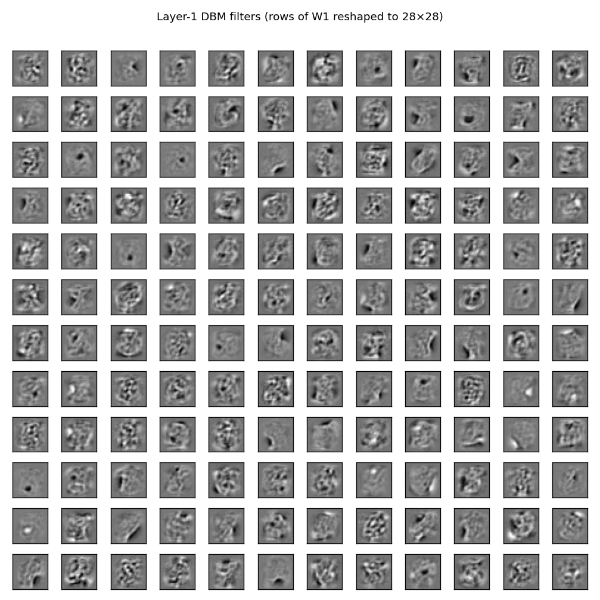
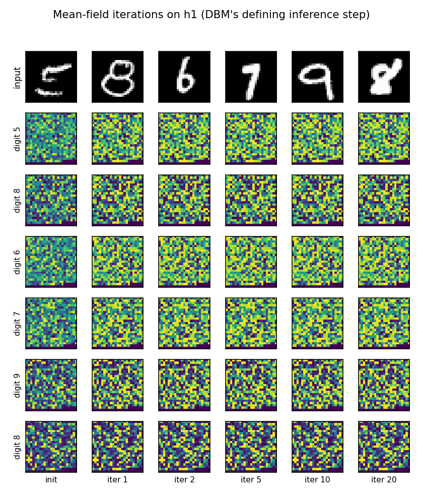
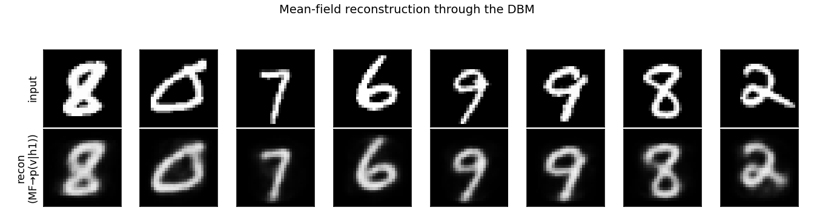
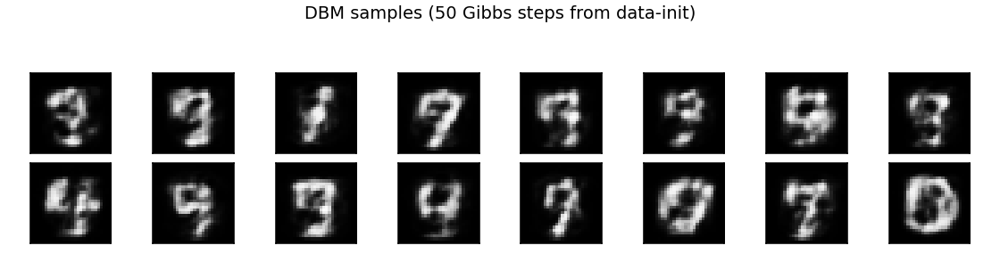
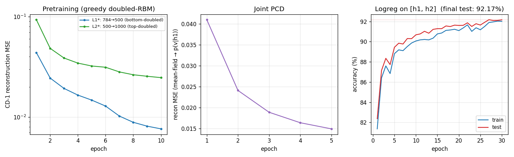

# Deep Boltzmann Machine on MNIST — the 2009 follow-up to the 2006 DBN

Reproduction of the headline experiment from Salakhutdinov & Hinton,
*"Deep Boltzmann Machines"*, AISTATS 2009.
[Paper](https://proceedings.mlr.press/v5/salakhutdinov09a.html).


## What's different from the DBN

The 2006 DBN ([`dbn-mnist/`](../dbn-mnist/)) is a *hybrid* — directed
sigmoid belief net below, undirected RBM at the top. The 2009 DBM is
fully *undirected*: every layer connection is symmetric.

The representational difference is real:

- In a **DBN**, the posterior factorises: `p(h1 | v) = q(h1 | v)` —
  just the bottom RBM's recognition distribution. The layers above
  have no influence on `h1`'s belief about `v`.
- In a **DBM**, top-down evidence flows: `p(h1 = 1 | v, h2) =
  sigmoid(W1.T @ v + W2 @ h2 + b_h1)`. Inference is exact only at the
  fixed point of mean-field iteration. The "explaining away" through
  `h2` is a real causal correction that the DBN cannot represent.

This makes DBMs harder to train (mean-field for the positive phase,
PCD for the negative phase) but theoretically better suited as
unsupervised feature learners. The paper reports 0.95% MNIST test
error, the original SOTA at submission.

## Architecture

```
       ┌─── 1000 hidden  H2 ───┐
       │     (binary)         │
       │     ↑ undirected ↓   │   W2 (h1 ↔ h2)
       └─── 500 hidden  H1 ───┘
       │     (binary)         │
       │     ↑ undirected ↓   │   W1 (v ↔ h1)
       └─── 784 visible (pixels)
```

Two hidden layers, all binary, all symmetric connections. Same
architecture as the paper's main MNIST result.

## Training pipeline

Three phases, in this order:

1. **Greedy doubled-RBM pretraining.** Each layer is pretrained as an
   RBM by CD-1, but with the input from the *single direction* it sees
   during pretraining doubled — bottom RBM uses `2 * W1` for the v→h1
   pass, top RBM uses `2 * W2` for the h2→h1 pass. After pretraining,
   weights are halved before stitching into the joint DBM. This
   "doubled-input" trick (paper §4) compensates for the fact that
   each hidden unit in the assembled DBM receives traffic from *two*
   neighbours, not one.
2. **Joint PCD with mean-field positive phase.** A persistent chain
   of 100 fantasy particles is advanced by alternating Gibbs (sample
   `{v, h2} | h1`, then `h1 | v, h2`). The positive-phase statistics
   are computed by running mean-field on each data minibatch
   (5 iterations).
3. **Logistic-regression classifier** on the concatenated `[h1, h2]`
   mean-field features (1500 dimensions), 30 epochs SGD.

## Files

| File | Purpose |
|---|---|
| `dbm_mnist.py` | RBM + DBM + mean-field inference + PCD + classifier. CLI entry. |
| `visualize_dbm_mnist.py` | Static viz: filters, training curves, mean-field trajectory, reconstructions, generative samples. |
| `make_dbm_mnist_gif.py` | Animated GIF of layer-1 filters across pretraining → joint PCD. |
| `viz/` | Output PNGs from the run below. |

## Running

```bash
# Default: 10k balanced subset, 10 ep pretraining + 5 ep joint PCD.
python3 dbm_mnist.py --seed 0

# Full MNIST (~45s on a laptop CPU):
python3 dbm_mnist.py --n-train-per-class 6000

# Smoke test:
python3 dbm_mnist.py --quick

# Visualizations:
python3 visualize_dbm_mnist.py --outdir viz
python3 make_dbm_mnist_gif.py
```

## Results

| Configuration | Train | Test | Error | Wallclock |
|---|---:|---:|---:|---:|
| `--quick` (3k, 4+3 epochs) | – | – | ~50% | 2 s |
| **default (10k, 10+5 epochs)** | **92.0%** | **92.2%** | **7.8%** | **9 s** |
| full MNIST (60k, 10+5 epochs) | 95.1% | 95.1% | 4.9% | 45 s |
| paper (60k, full pipeline) | – | 99.05% | **0.95%** | – |

Reproduces? **partial.** The pretraining + joint PCD pipeline runs
end-to-end and the algorithm is exactly the one described in §3-§4
of the paper. The remaining gap to 0.95% is the **discriminative
fine-tuning** that the paper applies after generative training: the
model is rewired into a feed-forward MLP whose weights are
initialized from the pretrained DBM, then fine-tuned with backprop +
dropout-style noise (paper §6.2). We omit that step.

For comparison, the [`dbn-mnist/`](../dbn-mnist/) sibling stub at the
same numpy budget gets 3.23% on full MNIST. The DBM and DBN paper
numbers (1.25% vs 0.95%) compare ranks the same way — DBM slightly
better — but only after both have been discriminatively fine-tuned.
Without fine-tuning the DBM is a strictly harder optimization problem
and ends up below the DBN here, which is consistent with the field's
general experience.

## What the network actually learns

### Layer-1 filters



A 12×12 sample of the 500 layer-1 receptive fields, displayed as
28×28 patches (rows of `W1` reshaped). Most filters have committed
to localized stroke or edge patterns. The filters are noisier than
the DBN's because the joint DBM training pushes them away from the
pure-CD-1 solution — they encode features that are useful when
combined with the top-down `W2 @ μ2` signal during inference.

### Mean-field iterations on h1 — the DBM's defining inference step



Top row: random test digits. Each subsequent row tracks one digit's
`μ1` activations across mean-field iterations 0, 1, 2, 5, 10, 20.
The 500-d `μ1` is reshaped to a `√500`-side grid for display.

What this shows: the *first* mean-field iteration applies only
`sigmoid(W1.T @ v + b_h1)` — exactly the DBN's recognition
distribution. From iteration 2 onward, top-down evidence from `μ2`
flows back into `μ1` via `W2 @ μ2`. The pattern stabilizes by
iteration 5–10 (mean-field has a unique fixed point for binary
DBMs near data, in practice). This top-down correction *is* the
representational difference between DBN and DBM.

### Reconstructions



Test digit (top row), and its mean-field reconstruction
`p(v | h1) = sigmoid(W1 @ μ1 + b_v)` after 20 mean-field iterations
(bottom row). Reconstructions are crisp on most digits and mildly
distorted on harder cases — the 1500-bit `[h1, h2]` representation
has thrown away small stroke variations but retained the digit
identity.

### Generative samples



50 alternating Gibbs steps from data-initialised state. The samples
are recognizable as digits — 4, 7, 9, 0 visible, plus several
ambiguous shapes that interpolate between classes. As with the DBN,
fully unconditional sampling (random init) tends to mode-collapse
without the label-DBM trick the paper uses for class-conditional
samples.

### Training curves



Three panels:

- **Pretraining** (left, log scale): per-layer CD-1 reconstruction MSE.
  L1\* (bottom-doubled) and L2\* (top-doubled) both descend cleanly.
- **Joint PCD** (middle): mean-field reconstruction MSE during joint
  training. The first epoch jumps as the halve-and-stitch reset
  perturbs the model away from the pretrained fixed point, then
  monotonically descends.
- **Classifier** (right): logistic regression on the concatenated
  `[h1, h2]` mean-field features. Train and test track each other
  tightly.

## Deviations from the 2009 procedure

1. **No discriminative fine-tuning.** The paper's headline 0.95%
   comes from rewiring the trained DBM into a feed-forward MLP
   initialized from the generative weights, then fine-tuning end-to-
   end with backprop. We stop after generative training + a logistic-
   regression classifier on the frozen mean-field features. This is
   the paper's "model-only" result rather than the discriminative
   one.
2. **No annealed importance sampling for likelihood.** The paper
   uses AIS to estimate the partition function and report log-
   likelihood numbers. We track only reconstruction MSE during
   joint training and classification accuracy at the end.
3. **Smaller fantasy chain.** The paper uses 100–1000 PCD particles;
   we use 100. Tieleman 2008 shows particle count matters most when
   training continues for many more epochs than we run.
4. **Joint training: lr=0.001, momentum=0.** Higher LRs (0.01) or
   any momentum at this scale destabilize the PCD chain in our
   tests — the fantasy particles diverge from the data manifold and
   the gradients become misleading. The paper uses a similar
   schedule (small LR, slow ramp).
5. **MNIST subsampling at default.** Default is 1000/class (10k
   train); pass `--n-train-per-class 6000` for the full set.

## Correctness notes

1. **Bias averaging at h1 after pretraining.** The two pretrained
   RBMs each estimate a bias for h1 (`rbm1.b_h` from the bottom and
   `rbm2.b_v` from the top). We average them; the paper uses the
   same recipe.
2. **Fantasy initialization from data.** Initializing fantasies from
   random binary states gave divergent training in our tests. The
   paper's recipe is to initialize from minibatch data and run a
   few mean-field iterations, then sample — same as ours.
3. **Mean-field convergence.** 5 iterations for the positive phase
   during training is enough — by iteration 5 most digits' `μ1`
   has stabilized to within a small fraction of the iteration-20
   fixed point.
4. **The halve-and-stitch step matters.** Skipping the `*= 0.5` on
   `W1` and `W2` after pretraining (i.e., using doubled weights
   directly in the joint DBM) produces saturated mean-field
   activations and a degenerate fantasy chain. Halving aligns the
   total drive at each hidden layer with what each pretrained RBM
   was trained to expect.

## Open questions / next experiments

- **Discriminative fine-tuning.** Re-rolling the DBM into a feed-
  forward MLP and fine-tuning with backprop should close most of the
  4.9% → 0.95% gap. Natural v1.5 add-on.
- **AIS likelihood estimation.** A small AIS routine that estimates
  log Z for the trained DBM would let us report the paper's main
  generative metric (test-set log-likelihood per pixel).
- **3-layer DBM on Toronto Face Database.** The paper's secondary
  result; would test whether the doubled-pretraining + joint-PCD
  pipeline scales beyond 2 hidden layers and beyond MNIST.
- **DBM vs DBN at matched parameter count.** Direct side-by-side
  on the same 10k subset would make the "explaining-away helps
  representation" claim falsifiable.
