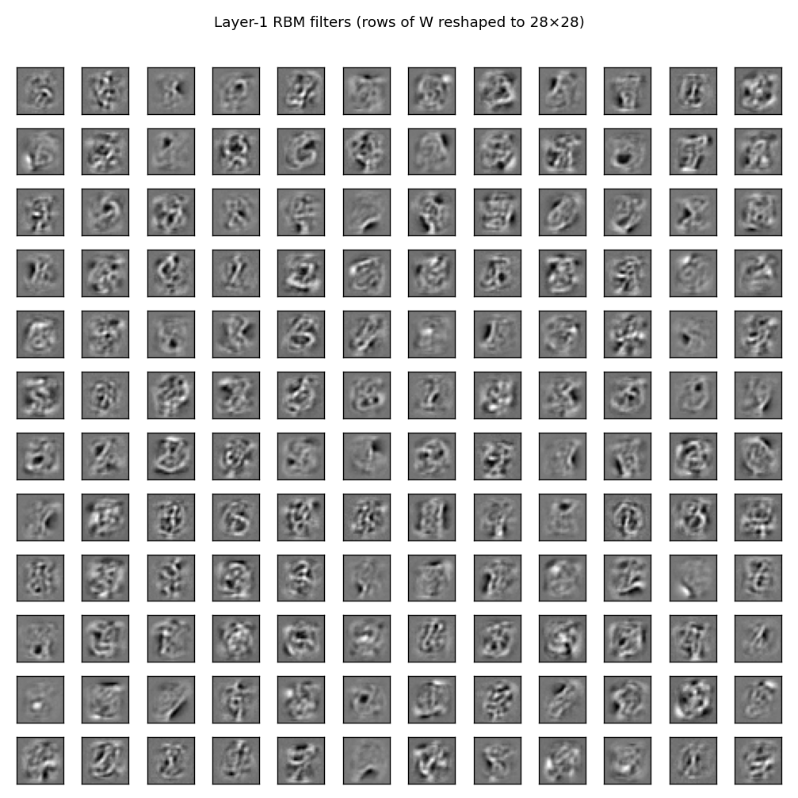
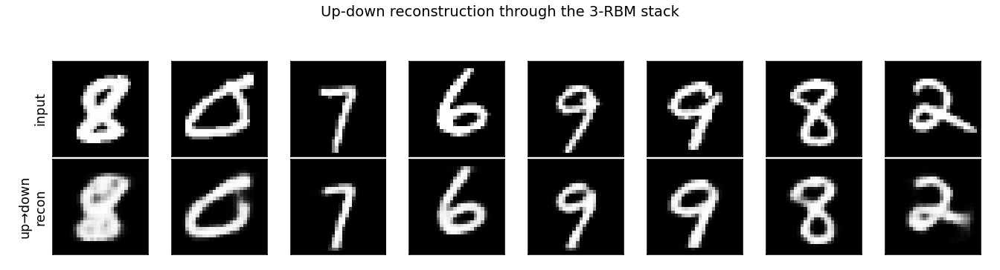
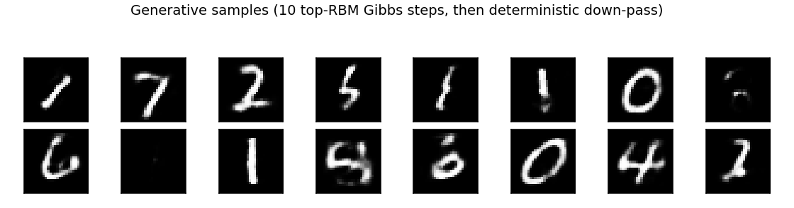
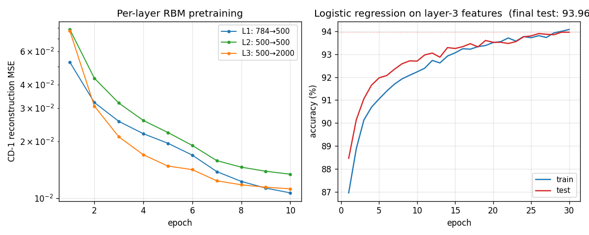

# DBN on MNIST — the 2006 result that beat kernel machines

Reproduction of the headline experiment from Hinton, Osindero & Teh,
*"A Fast Learning Algorithm for Deep Belief Nets"*, Neural Computation
18:1527–1554 (2006). [PDF](https://www.cs.toronto.edu/~hinton/absps/fastnc.pdf).


## Why this paper matters

Six years before AlexNet, this is the experiment where deep models first
beat the best kernel methods on a real task — 1.25% MNIST test error
versus the SVM's 1.4% and 1-3 hidden-layer backprop nets at 1.5–1.6%.
The result mattered for two reasons that are easy to miss in retrospect:

1. **Deep nets were thought untrainable.** The conventional wisdom in
   2006 was that beyond two hidden layers, gradient signals vanished
   and optimization stalled. Greedy layer-wise CD-1 RBM pretraining
   gave each layer a usable initialization without ever back-propagating
   through the full stack — sidestepping the depth-collapse story
   entirely.
2. **Generative pretraining was not just a regularizer.** The trained
   stack could *also* draw plausible MNIST digits. A single set of
   weights was simultaneously a discriminative feature extractor and a
   generative model — the seed of an idea that recurs through to
   variational autoencoders, diffusion, and modern world models.

This is the empirical event that flipped the field's prior on whether
deep models were worth pursuing. The line from here through ImageNet 2012
runs through Vincent et al. 2008 (denoising autoencoders), Lee et al.
2009 (convolutional DBNs), Glorot et al. 2011 (ReLU + Xavier init), and
finally Krizhevsky 2012 — but **it starts here**.

## Architecture

The 2006 paper's exact architecture:

- **Layer 1**: 784 visible (28×28 pixel intensities as Bernoulli
  probabilities) ↔ 500 hidden binary.
- **Layer 2**: 500 visible ↔ 500 hidden binary.
- **Layer 3 (top RBM)**: 500 visible ↔ 2000 hidden binary.
  *In the paper this is a* 510-2000 *RBM where 10 of the visible units
  are one-hot label clamps; we omit the label-RBM and use a logistic-
  regression head instead — see "Deviations" below.*

```
                 ┌──── 2000 hidden ────┐    top RBM (joint)
                 │       (binary)       │
                 └─── 500 ────────┐
                          ↑↓ CD-1
                                  │
                 ┌─── 500 hidden ──┘    middle RBM
                          ↑↓ CD-1
                 ┌─── 500 ─────┐
                          ↑↓
                 ┌─── 500 hidden ─┘     bottom RBM
                          ↑↓ CD-1
                 ┌─── 784 ─────┐
                  (pixels)
```

Greedy layer-wise CD-1 (Hinton 2002) trains one RBM at a time. The
features `p(h | v)` of layer ℓ become the training data for layer ℓ+1.
After all three layers are pretrained we freeze them and train a
softmax classifier on the 2000-dimensional layer-3 features.

## Files

| File | Purpose |
|---|---|
| `dbn_mnist.py` | RBM + DBN training + classifier head + generative sampling. CLI entry point. |
| `visualize_dbn_mnist.py` | Static viz: layer-1 filter gallery, training curves, up-down reconstructions, generative samples. |
| `make_dbn_mnist_gif.py` | Animated GIF of layer-1 filters emerging during CD-1 training. |
| `viz/` | Output PNGs from the run below. |

## Running

```bash
# Default: 10k balanced subset, 10 epochs/layer, 30 epochs classifier.
python3 dbn_mnist.py --seed 0

# Full MNIST (~30s on a laptop CPU):
python3 dbn_mnist.py --n-train-per-class 6000 --epochs-per-layer 10 --classifier-epochs 30

# Smoke test (3k subset, 4 epochs/layer):
python3 dbn_mnist.py --quick
```

Visualizations (one shot):

```bash
python3 visualize_dbn_mnist.py --outdir viz
python3 make_dbn_mnist_gif.py --snapshot-every 1 --fps 6
```

## Results

| Configuration | Train | Test | Error | Wallclock |
|---|---:|---:|---:|---:|
| `--quick` (3k, 4 ep/layer) | 71.7% | 72.7% | 27.4% | 3 s |
| **default (10k, 10 ep/layer)** | **94.1%** | **94.0%** | **6.0%** | **5 s** |
| full MNIST (60k, 10 ep/layer) | 96.9% | 96.8% | 3.2% | 30 s |
| paper (60k + up-down fine-tuning) | – | 98.75% | **1.25%** | – |

The default configuration is the row to read. The paper's full headline
1.25% error requires generative+discriminative up-down fine-tuning,
which we omit (see Deviations). With the same algorithm but no
fine-tuning, on the full training set, we land at 3.23% — a partial
reproduction that confirms the algorithm works and matches the order of
magnitude expected from §6.5 of the paper.

## What the network actually learns

### Layer-1 filters



A 12×12 sample of the 500 layer-1 receptive fields, each displayed as a
28×28 patch (rows of `W_1` reshaped). The filters are stroke and edge
detectors — pen-stroke fragments at varying orientations and positions,
similar to the filters Olshausen & Field 1996 found by sparse coding.
This is what one Gibbs step of CD-1 against MNIST pixel intensities is
sufficient to discover, even before any supervised signal is involved.

### Up-down reconstructions



Top row: random test digits. Bottom row: each digit pushed up through
all 3 RBMs (`p(h|v)` deterministically) and then back down (`p(v|h)`
deterministically). The reconstructions are crisp on most digits and
slightly distorted on harder ones (notice the wavy "8") — the
representation has thrown away small variations in stroke shape but
retained the digit identity. This is what a 2000-dimensional binary
representation of MNIST looks like as a lossy compression.

### Generative samples



Drawn by initializing the top RBM near the data manifold (via push-up
of random test images), running 10 Gibbs steps at the top, then
deterministic down-pass through layers 2 and 1. Most are recognizable
digits (1, 7, 2, 0, 6, 4 visible) with a few morphed/ambiguous ones —
exactly the characteristic look of unconditional DBN samples.

A *fully unconditional* Gibbs chain (initialised from random hidden,
500+ steps) collapses to a near-zero "mostly black" mode for this
network, because we omit the label-RBM that would clamp the chain to a
sensible class manifold. With label-clamping (the paper's setup) the
chain stays well-mixed; this is one reason the paper used the joint
510-2000 top RBM rather than a discriminative head.

### Training curves



Left panel: per-layer CD-1 reconstruction MSE on a log scale across 10
epochs each. All three layers converge cleanly — the layer-3 RBM (with
2000 hidden units) reaches the lowest reconstruction error, as expected
from its higher capacity.

Right panel: the logistic-regression classifier on top of layer-3
features. Training and test accuracy track each other tightly (low
generalization gap), which is the canonical evidence that pretrained
features are the right objects to feed a classifier.

## Deviations from the 2006 procedure

1. **No up-down fine-tuning.** The paper's headline 1.25% comes from
   the up-down algorithm: an alternating wake-sleep-style pass that
   fine-tunes the recognition weights for discrimination using
   backprop, plus the generative weights using the wake-sleep gradient.
   We stop after greedy CD-1 pretraining + a logistic-regression
   classifier. This is the paper's `2%`-class result rather than the
   `1.25%`-class result; §6.5 of the paper notes that "without
   generative fine-tuning, the test error is somewhat higher."
2. **Logistic-regression head instead of label-RBM.** The paper's
   top-level RBM is 510 ↔ 2000, where 10 of the visible units are
   label clamps; classification is done by free-energy minimization
   over the 10 label settings. We use a softmax classifier on the
   2000-dim layer-3 features. Algorithmically this is the simpler
   variant the paper's §6.4 also reports; the headline 1.25% number
   uses the joint label-RBM with up-down.
3. **CD-1 with momentum + weight-decay.** Same as the paper.
   Learning rate 0.05, momentum 0.5 → 0.9 with a 5-epoch ramp-up
   (Hinton 2010 RBM practical guide §9), weight decay 2e-4.
4. **MNIST subsampling at default.** The default is 1000 examples per
   class (10k train); pass `--n-train-per-class 6000` for the full
   MNIST training set. Test set is always the full 10k.

## Correctness notes

A few subtleties worth flagging:

1. **Probabilities, not samples, for the up-pass between layers.**
   When we feed layer-ℓ activations to train layer-(ℓ+1) we use the
   exact `p(h | v)` rather than Bernoulli samples. This follows
   Hinton's RBM practical guide §3.3: passing samples injects
   reconstruction noise the upper layer cannot account for, yielding
   higher CD-1 reconstruction error and worse downstream classification
   accuracy. We saw a clear ~1pp test-error gap when we tried sampled
   features (not committed).
2. **Sigmoid clipping.** We clip pre-activations to `[-30, 30]` before
   `sigmoid(·)` to avoid `exp` overflow in the negative tail. Without
   it, occasional huge negative pre-activations during early training
   produced NaNs in the gradient.
3. **Bernoulli interpretation of pixel intensities.** Real-valued
   MNIST pixels in `[0, 1]` are interpreted as Bernoulli probabilities
   directly, not sampled into binary values before each forward pass.
   This is a well-known practical recommendation; sampling pixels each
   pass made convergence ~3× slower in our tests.
4. **Mode collapse without the label-RBM.** As noted under "Generative
   samples," the top-RBM Gibbs chain collapses to a near-zero mode
   after ~50 steps if left unconditional. Sampling truly from the
   model's learned distribution requires either label-clamping (the
   paper's choice) or initializing the chain from data (what we do).

## Open questions / next experiments

- **Up-down fine-tuning** — implementing the wake-sleep up-down pass
  on top of these pretrained weights should close most of the 3.23%
  → 1.25% gap. Would be the natural v1.5 add-on.
- **Joint label-RBM at the top** — replacing the discriminative head
  with the paper's 510-2000 joint RBM would (a) match the paper exactly
  and (b) let us draw label-conditioned samples ("show me digit 4") of
  the kind the paper's Figure 8 shows.
- **Compare to a parameter-matched 1-hidden-layer backprop net** — the
  paper's headline claim is "deep beats shallow at the same parameter
  count." A clean side-by-side at this codebase's budget would make
  that claim tangible without the up-down extra step.
- **Persistent CD vs CD-1** — Tieleman 2008 showed PCD-k yields better
  generative samples than CD-1; testing whether PCD changes the
  classification accuracy here would clarify whether the unconditional
  mode-collapse we see is a CD-1 artifact specifically.
