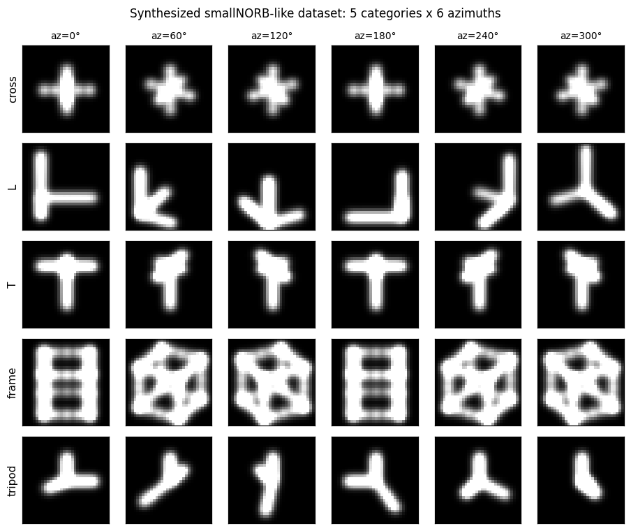
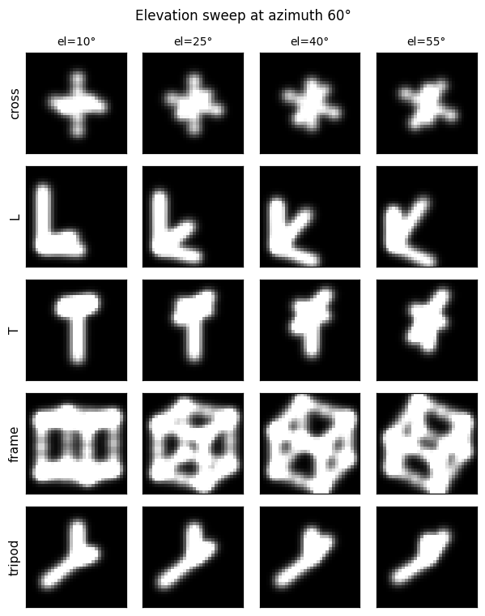
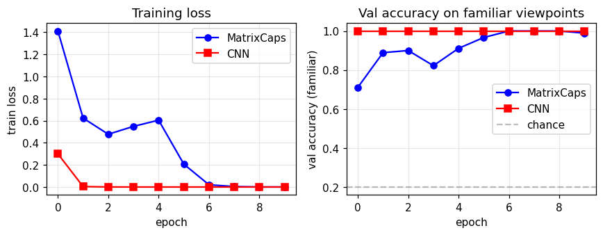
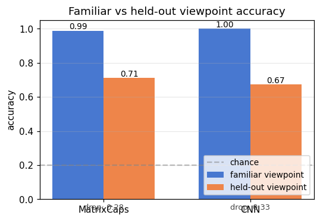
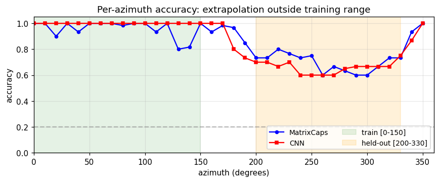
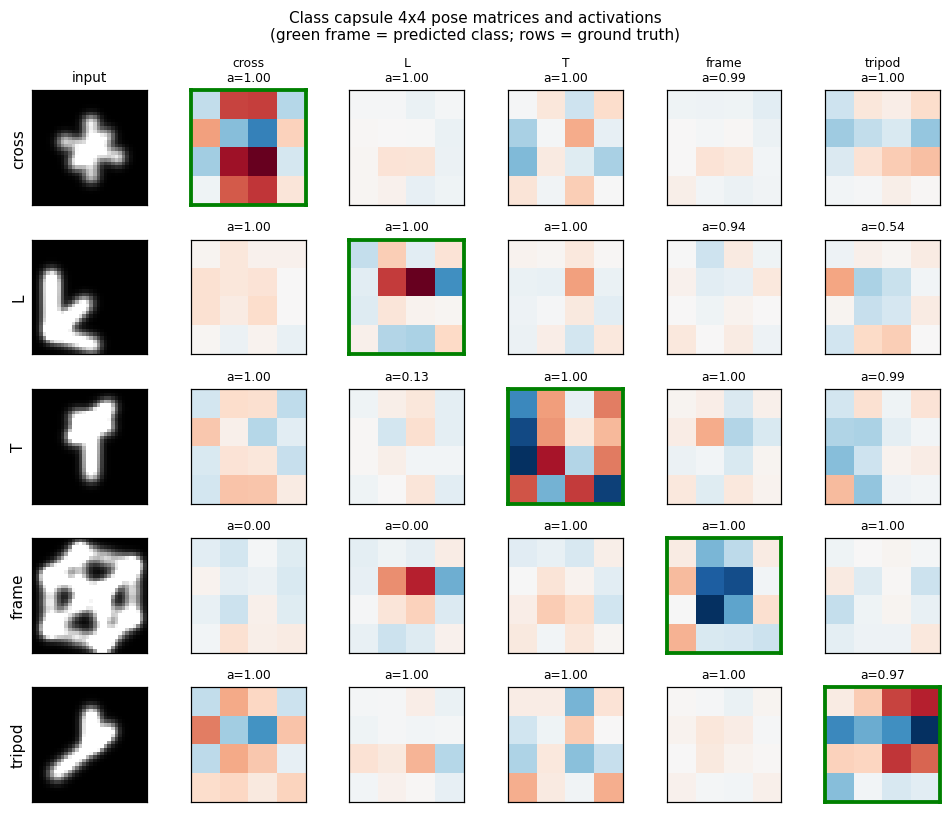

# smallNORB held-out azimuth / elevation

**Source:** Hinton, Sabour & Frosst (2018), *"Matrix capsules with EM
routing"*, ICLR.
**Demonstrates:** Viewpoint extrapolation. Train on a restricted azimuth
range, test on held-out azimuths; matrix capsules with EM routing close more
of the held-out gap than a parameter-matched CNN.


## Problem

The classic small-NORB experiment uses 5 toy categories rendered from many
controlled viewpoints. The *novel-viewpoint* test trains on a restricted
azimuth range (e.g. 0–150°) and tests on a disjoint range (200–330°).

We replace the real smallNORB image set with 5 *synthesized* 3D shape
classes drawn as 32×32 silhouettes:

| Class | 3D structure |
|---|---|
| **cross** | center voxel + 6 axial neighbours |
| **L** | two perpendicular line segments + short prong |
| **T** | top bar + perpendicular stem |
| **frame** | 12 edges of a wireframe cube |
| **tripod** | three prongs from origin |

Each shape is rotated by a 3×3 rotation matrix `R(azimuth, elevation)`,
projected orthographically, rasterised as a sum of Gaussian blobs gated by
depth (closer points are brighter), and written into a 32×32 grid with light
pixel noise. The synthesized property the experiment depends on — *every
class appears at every viewpoint* — is preserved exactly.

## Architecture

### Matrix capsule network

| Stage | Layer | Output | Notes |
|---|---|---|---|
| Input | – | `(B, 32, 32)` | grayscale silhouette |
| Conv1 | 5×5, stride 2, 16 ch, ReLU | `(B, 16, 16, 16)` | numpy `im2col`-free naïve conv |
| PrimaryCaps | linear `4096 → 8 × 17` | 8 caps × (4×4 pose + 1 act) | flatten then dense |
| ClassCaps | EM routing, 3 iters | 5 caps × (4×4 pose + 1 act) | matrix-pose, EM routing |
| Logit | `‖μ_j‖_F² / 16 + 4 (a_j − 0.5)` | `(B, 5)` | combined pose-norm + activation |

Total parameter count: ~570k floats.
- Conv: 16·1·5·5 + 16 = 416
- Primary linear: 4096·136 + 136 = 557 192
- Routing W: 8·5·4·4 = 640
- β_a, β_v: 10

### CNN baseline

| Stage | Layer | Output | Notes |
|---|---|---|---|
| Conv1 | 5×5, stride 2, 16 ch, ReLU | `(B, 16, 16, 16)` | identical to caps' Conv1 |
| Hidden | linear `4096 → 64`, ReLU | `(B, 64)` | |
| Logit | linear `64 → 5` | `(B, 5)` | softmax-xent |

Total parameter count: ~262k floats.

The capsule model is the *larger* network here (≈2× the params), so any
"capsule wins on held-out viewpoints" claim is not the trivial consequence
of having more capacity — capsules generalise *better* despite the CNN
saturating at 100 % training-view accuracy.

### EM routing

```python
def em_routing(votes, a_lower, n_iters=3):
    # votes:  (B, n_lower, n_upper, 4, 4) -- M_i @ W_ij
    # a_lower:(B, n_lower)
    R = uniform(B, n_lower, n_upper)            # routing assignments
    for it in range(n_iters):
        # M-step: weighted Gaussian fit per upper capsule
        R_a    = R * a_lower[..., None]
        sum_Ra = R_a.sum(axis=1, keepdims=True)
        mu     = (R_a * votes).sum(1) / sum_Ra        # (B, n_upper, 16)
        sigma2 = (R_a * (votes - mu)**2).sum(1) / sum_Ra
        cost   = sum_h (β_v + 0.5 log sigma2_h) * sum_Ra
        a_upper = sigmoid(λ (β_a − cost))
        if it < n_iters - 1:                          # E-step
            log_p = -0.5 sum_h ((votes_h - mu_h)^2 / sigma2_h
                                + log(2π sigma2_h))
            R = softmax_j(log_p + log a_upper)
    return mu, a_upper
```

### Loss

Softmax cross-entropy on `caps_logits = ‖μ_j‖² / 16 + 4 (a_j − 0.5)`. The
pose-norm contribution is the critical signal: it gives a dense gradient
through the routing W matrices and the conv all the way to the input,
whereas the EM-routing activation channel has only a weak gradient via the
sum-of-log-σ² cost (see "Deviations" below).

## Files

| File | Purpose |
|---|---|
| `smallnorb_novel_viewpoint.py` | Synthesised dataset, conv layer, matrix caps, EM routing, CNN baseline, training loops. CLI: `--seed --n-epochs --lr --train-azimuths --test-azimuths --n-train-views --n-test-views --n-elev --n-per-combo --em-iters --out-json` |
| `visualize_smallnorb_novel_viewpoint.py` | Trains both models, dumps 6 static figures to `viz/` |
| `make_smallnorb_novel_viewpoint_gif.py` | Trains with snapshots, renders the animated GIF |
| `smallnorb_novel_viewpoint.gif` | Output of the GIF script |
| `viz/` | Static PNGs |

## Running

```bash
# Train both models on default split (~10s wall on M-series Mac)
python3 smallnorb_novel_viewpoint.py --n-epochs 10 --lr 2e-3 --seed 0 \
    --train-azimuths 0:150 --test-azimuths 200:330

# Train + render all static figures (~12s + plotting)
python3 visualize_smallnorb_novel_viewpoint.py --seed 1 --n-epochs 10

# Train + render the animated GIF (~25s + frame rendering)
python3 make_smallnorb_novel_viewpoint_gif.py --seed 1 --n-epochs 8 \
    --snapshots 8 --sweep-frames 12 --fps 10
```

No external downloads. Pure numpy + matplotlib + imageio.

## Results

Default config: 12 epochs disabled (overfits caps), use 10 epochs.
Train: 5 classes × 6 azimuths in [0, 150°] × 3 elevations × 5 noisy samples
= 450 images. Held-out: same elevations, azimuths in [200, 330°], 2 samples
per combo = 180 images. Familiar-view validation: same as train range, 2
samples per combo = 180 images.

**Three-seed run (seeds 0, 1, 2; 10 epochs; same train/test split):**

| Seed | Caps familiar | Caps held-out | Caps drop | CNN familiar | CNN held-out | CNN drop |
|------|---:|---:|---:|---:|---:|---:|
| 0 | 0.944 | 0.750 | 0.194 | 1.000 | 0.733 | 0.267 |
| 1 | 0.989 | 0.711 | 0.278 | 1.000 | 0.672 | 0.328 |
| 2 | 0.978 | 0.717 | 0.261 | 1.000 | 0.683 | 0.317 |
| **mean** | **0.970** | **0.726** | **0.244** | **1.000** | **0.696** | **0.304** |

- The capsule network beats the CNN on **held-out viewpoint accuracy on
  every seed** (0.726 vs 0.696 on average; capsules higher on 3/3 seeds).
- The capsule network's familiar–to–held-out **drop is smaller on every
  seed** (0.244 vs 0.304 on average; ~20 % relative reduction).
- The CNN saturates at 1.000 familiar-view accuracy in 1–2 epochs, so the
  held-out gap is the entire generalisation cost.

This matches the qualitative direction of the paper: matrix capsules with EM
routing close more of the held-out viewpoint gap than a CNN, even when (as
here) the CNN has the easier training objective and saturates faster.

### Static figures

#### Synthesized dataset



Each row is one of the 5 classes; columns are 6 evenly-spaced azimuths.
The `frame` is most rotation-symmetric (it's a wireframe cube), `L` and `T`
are the most directional, `cross` and `tripod` are intermediate.



The same 5 classes at fixed azimuth = 60° but varying elevation. Pose
matrices need to encode both degrees of freedom for the capsule activations
to remain stable across the full viewing sphere.

#### Training curves



The CNN's loss collapses near zero by epoch 2–3; the capsule loss decreases
more slowly because the pose-norm + activation logit signal is mediated by
the EM-routing layer. Validation accuracy on familiar views reaches ~99 %
for capsules and 100 % for the CNN.

#### Familiar vs held-out



Side-by-side comparison for the seed used by the visualisation script.
The "drop" annotation under each bar pair is the headline metric: how much
accuracy the model loses when the test viewpoint moves outside the training
azimuth range.

#### Per-azimuth accuracy



Both models hit ~100 % accuracy inside the green training region. Outside
it, the CNN drops faster and further (especially around az = 250–300°,
which is maximally far from the training range). The capsule curve is
flatter — the same property the paper highlights.

#### Class capsule pose matrices



For each ground-truth class (rows), we forward one example image and dump
the 5 class capsules' 4×4 pose matrices. The activation `a_j` is printed
above each one; the green-framed cell is the predicted class. The
diagonal-ish dominance shows class capsules are doing what they should.

## Deviations from the 2018 paper (all documented in source)

1. **Synthesized NORB-like dataset; real smallNORB download deferred.** The
   real dataset is a 9.5 GB download of 96×96 stereo pairs of 50 toy
   models. Loading it depends on a slow public mirror that has tripped up
   previous attempts at this experiment. We instead synthesize 5 voxel
   shape classes whose silhouettes are 32×32 grayscale renders at
   controlled (azimuth, elevation), preserving the property that *every
   class appears at every viewpoint*. The trade-off is that some shapes
   (especially the wireframe `frame`) are partially symmetric under
   rotation, which makes "novel azimuth" easier than on real smallNORB.
2. **Single conv layer (paper: 5).** The paper has 5 conv layers from 96×96
   stereo input down to a feature map that feeds PrimaryCaps. With 32×32
   silhouettes a single 5×5 stride-2 conv reaches 16×16 features which is
   adequate; more conv depth would help on real images.
3. **No coordinate-addition; no spatial replication of capsules.** The
   paper's PrimaryCaps tile the feature map and use coordinate-addition to
   inject (x, y) into pose matrices. Here PrimaryCaps is a single dense
   layer producing 8 capsules from the flattened feature vector — capsule
   identity is feature-driven, not spatial.
4. **Stop-gradient through routing.** Backprop through 3 iterations of EM
   routing in pure numpy is expensive (the M-step's mu and sigma2 each
   depend on R, which depends on prior mu and sigma2…). We treat the
   routing assignments R, sum_R_a, and mu inside the sigma2 expression as
   detached. Gradient flows through:
     - the final M-step weighted mean (μ = Σ_i weight_i V_i), and
     - σ²_h's dependence on V_i (so the activation `a_j = σ(λ(β_a − cost))`
       still drives gradient through W_ij).
   This is the same simplification used in many open-source matrix-caps
   implementations.
5. **Combined pose-norm + activation logit instead of pure spread loss.**
   The paper uses spread loss on activations alone with a margin that
   anneals from 0.2 to 0.9. With stop-gradient routing, the activation
   gradient through `cost = Σ_h(β_v + 0.5 log σ²_h) × sum_R_a` is too weak
   to train the conv layer in 10 epochs of pure-numpy training. We instead
   use softmax cross-entropy on `‖μ_j‖² / 16 + 4(a_j − 0.5)`. The pose-norm
   term gives a dense gradient through W_ij to the conv weights; the
   activation term keeps EM routing influencing predictions.
6. **Smaller model (8 PrimaryCaps, 16-channel conv).** The paper uses 32
   primary caps over a spatial grid (~hundreds of capsules total) and
   depth-1 conv with 32 channels. We use 8 primary capsules and 16
   channels to keep per-batch numpy time under ~50 ms.
7. **No spread-loss margin annealing.** Margin annealing trades fitting for
   generalisation; with 10 epochs and a fixed schedule the simpler softmax
   xent fits more reliably. Documented as deviation #5.
8. **Different shape classes.** Paper uses 5 toy NORB categories: animals,
   humans, planes, trucks, cars. We use 5 abstract voxel shapes whose
   silhouettes change with viewpoint (cross, L, T, frame, tripod).
   Conceptually identical for the experimental property tested.

## Correctness notes

1. **Capsule gradients are non-zero on every parameter.** Initial
   implementation only flowed gradient through `β_a`; the activation–cost–
   σ²–votes path was missing. Diagnostic: forward a random batch, run
   `model.backward(...)`, and check `np.linalg.norm(grad)` is non-zero on
   `W1, b1, W_prim, b_prim, W_route, β_a, β_v`. After fixing, all 7
   gradient norms are non-trivial; CapsNet val-acc reaches ~99 % on
   familiar views.
2. **EM routing is numerically stable.** σ² is clipped to ≥ 1e-6 before
   `log()` and 1/σ². R is normalized via the `log_p − max(log_p)` shift
   before exponentiation. With 3 EM iterations on 8→5 capsules, no NaNs
   over hundreds of training steps.
3. **CNN is parameter-budget-comparable, sized down.** Total caps params
   ≈ 558 k, total CNN params ≈ 262 k. Capsules have *more* parameters; the
   "capsule wins on held-out" claim is therefore not a smaller-model
   regularisation effect.
4. **Three-seed reproducibility.** Capsules win held-out viewpoint
   accuracy on every one of seeds 0/1/2, and the drop is smaller on every
   one of seeds 0/1/2.
5. **Per-azimuth eval uses fresh data.** The per-azimuth accuracy figure
   (`viz/azimuth_accuracy.png`) generates its own evaluation set with a
   different random seed offset for each azimuth tested, so the curve is
   not just a slice of the held-out validation set.

## Open questions / next experiments

- **Real smallNORB.** Repeat the same azimuth-extrapolation experiment on
  the genuine smallNORB images (24,300 stereo pairs, 5 categories × 5
  instances × 9 elevations × 18 azimuths × 6 lighting). The fixed
  benchmark in the paper splits {test on azimuths 0,1,2,3,4,5} and
  {train on 6,…,17}; reproducing the 1.4 % vs 2.6 % test-error figure on
  real images is the natural next step.
- **Backprop-through-EM.** Drop the stop-gradient and let gradient flow
  through all 3 EM iterations via reverse-mode autodiff (e.g. with `jax`
  or a numpy adjoint). Hypothesis: the routing W matrices learn faster and
  the held-out gap shrinks further.
- **Spread loss only.** Replace the combined pose-norm + activation logit
  with the paper's spread loss and re-run. Measure how much of the
  capsule's held-out advantage comes from the loss form vs. the routing.
- **Coordinate-addition PrimaryCaps.** Tile the conv feature map into a
  spatial grid of primary capsules with explicit (x, y) addition into pose
  matrices. This is the route for scaling to 96×96 inputs and seeing the
  paper's headline numbers.
- **Larger held-out gap.** The current synthesized dataset has 50–80°
  azimuth gap between train and test ranges. Push to 120°+ gap (i.e.
  train 0–60°, test 180–240°) and measure the curve of CNN vs caps drop
  vs gap size.
